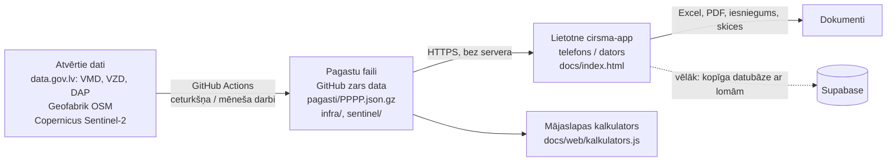

# FF Forest meža sistēma: tehniskā un lietotāja dokumentācija

Versija: 2026-09-01 (lietotne v0.24). Kods un dati: https://github.com/kgudonis-dotcom/geo-ingest
Darbu dēlis: https://github.com/kgudonis-dotcom/geo-ingest/issues · Kopsavilkums: STATUSS.md

Dokuments rakstīts cilvēkam, kas nav programmētājs, bet grib saprast, kas notiek, kur kas atrodas un ko drīkst mainīt. Tehniskās detaļas ir atsevišķos blokos, tās var izlaist.

---

## 1. Kas šī ir par sistēmu, vienā rindkopā

Ievadi zemes vienības kadastra numuru, sistēma no Valsts meža dienesta (VMD) un citiem atvērtajiem datiem uzbūvē objektu: nogabalus ar taksāciju un kontūrām, kaimiņus, dabas aizsardzības ierobežojumus, un uzreiz izrēķina cirsmas pēc likuma (MK 935), koksnes vērtību, nekustamā īpašuma vērtību, IRR un bruto peļņu, uzzīmē skices un sagatavo iesniegumu VMD. Cilvēks labo to, ko redz mežā, un sistēma pārrēķina. Tālāk objekts iet cauri CRM plūsmai (vērtēšana → piedāvājums → vienošanās → nopirkts) ar uzdevumiem pa lomām, un nonāk fondā.

## 2. Sistēmas daļas un kā tās saistās



Trīs slāņi:

| Slānis | Kas tas ir | Kur atrodas | Kad mainās |
|---|---|---|---|
| **Datu ķēde** | Python skripti, ko GitHub Actions palaiž pēc grafika vai pēc pieprasījuma; tie novelk atvērtos datus un sagriež pa pagastiem | repo `main` zars: `build_pagasti.py`, `build_infra.py`, `sentinel.py`, `export_geo.py`, `ingest.py`, `discover.py`, `.github/workflows/*.yml` | reizi ceturksnī (VMD publicē pa ceturkšņiem), OSM reizi mēnesī, Sentinel pēc pieprasījuma |
| **Dati** | Gatavi faili, ko lietotne lasa | repo `data` zars: `pagasti/`, `infra/`, `sentinel/`, `aplieci/` | katru reizi, kad datu ķēde nostrādā |
| **Lietotne** | Viens HTML fails ar visu loģiku, strādā pārlūkā, arī bezsaistē | repo `app/index.html` (avots) un `docs/index.html` (publicētais), tiešsaistē https://kgudonis-dotcom.github.io/geo-ingest/ | ar katru versiju |

Principi, kas nosaka uzbūvi: bez servera (nav ko uzturēt un nav ko maksāt), viss atvērtajos datos, viss, ko cilvēks labo, paliek ierīcē un nekad netiek pārrakstīts ar automātiku, krāsas nozīmē vienu un to pašu (dzeltens = ar roku, zils = automātiski, sarkans = aizliegums vai nokavēts).

---

## 3. Datu ķēde (geo-ingest)

### 3.1. Pagasta fails: galvenā datu vienība
Kadastra apzīmējuma pirmie 4 cipari ir pagasta (administratīvās teritorijas) kods. Katrs pagasts ir viens saspiests fails `pagasti/PPPP.json.gz` (0,5 līdz 5 MB), kurā ir visas tā pagasta meža zemes vienības:

```json
{"pagasts":"7060","updated":"2026-09-01","ladSig":{"n":842,"maxdate":1735689600000},"zv":{
  "70600050074":{
    "stands":[{"kv":"4","nog":"22","anog":null,"plat":0.71,"zkat":"10","mt":"5",
               "s10":"9","a10":44,"h10":19,"d10":20,"g10":19, "s11":"4",...,
               "p_cirp":"11","p_cirg":2017,"saimn_d_ie":6,"bon":"II",
               "geom":[[lon,lat],[lon,lat],...]}],
    "adj":[[0,2,112],[0,10,61]],
    "iadt":[{"kind":"iadt","name":"Vestiena","zone":"AAA","ha":28.1}],
    "kaimini":[{"kad":"70600050099","len_m":393,"owner":null}],
    "lielie":[{"owner":"AS Latvijas valsts meži","hops":1,"kad":"...","dist_m":0}],
    "lad":{"ha":0.42,"blocks":["7060123-4"]},
    "expl":{"liz":0.15,"krum":0.03,"mezs":0.71,"purvs":0,"udens":0,"ekas":0,"celi":0.02,"cita":0},
    "ni":{"nr":"70600050074001","name":"Ezermuiža"}
  }}}
```

Lauku nozīme (VMD Meža valsts reģistra struktūra):
- `kv`, `nog`, `anog`: kvartāls, nogabals, apakšnogabals. `plat`: platība ha. `zkat`: zemes kategorija (10 = mežaudze; pilna tabula `ZKAT_CODES`, VMD ZKAT_klasifikators, pārbaudīts #74 — iepriekš `m.veids` bija VIENMĒR "Mežaudze" neatkarīgi no koda, tagad pareizi atšifrē arī 14=Izcirtums, 21-23=purvi, 31-34=lauces/virsāji/smiltāji u.c.). `mt`: meža tipa kods (5 = Vēris; pilna tabula lietotnē `MT_CODES`, VMD MT_klasifikators, pārbaudīts un LABOTS #74 — iepriekšējā tabula trūka kodus 15/16 un kodi 17-25 bija nobīdīti par 2, tāpēc āreņu/kūdreņu nogabaliem rādījās NEPAREIZS nosaukums; mitruma grupa/limits neizmainījās, jo visi šie kodi abās versijās ir "slapjie").
- `s10..s14`: 1. stāva elementu sugas — pilns kods-suga saraksts `SP_CODES` (VMD S_klasifikators, 1-69, pārbaudīts un PAPILDINĀTS #74: 19 kodu trūka — piem. 21 Blīgzna, 24 Kļava, 61-69 "citi X" — un koku elements ar kādu no tiem tika klusi izlaists no G/krājas summas; tagad visi neatpazītie/mazākie kodi iet "Citas sugas"). Astoņas galvenās (Priede 1, Egle 3, Bērzs 4, Melnalksnis 6, Apse 8, Baltalksnis 9, Ozols 10, Osis 11) ir savas lietotnes SPECIES kategorijas, pārējie 61 kods apvienojas "Citas sugas". `a`/`h`/`d`/`g`/`n`: vecums, augstums, caurmērs, šķērslaukums, koku skaits katram elementam.
- `p_cirp`/`p_cirg`: pēdējās cirtes veids un gads; `p_darbv`/`p_darbg`: pēdējā darbība; `saimn_d_ie`: saimnieciskās darbības ierobežojuma kods (APROB klasifikators, "Aizliegts KailC" analogs); `jakopj`, `jaatjauno`: VMD karodziņi.
- `bon`: valdošās sugas bonitāte, VMD BON klasifikators (kods 0-6 → Ia, I, II, III, IV, V, Va; 0 = Ia, labākā). Avots: `gis.vmd.gov.lv/Public/GetClasificators` (xlsx), lapas "BON_klasifikators" / "Struktūra_KOPĀ", lauks "BON". Nosaka `cirtmetsKC` slieksni lietotnē (#46); ja tukšs, cirtmets netiek noteikts (nevis pieņemts sliktākais gadījums).
- `geom`: nogabala kontūra WGS84 (lon, lat), vienkāršota līdz 1 m. **#22 (SCHEMA_VERSION 2):** gredzenu saraksts `[ārējais, caurums1, caurums2, ...]` (GeoJSON Polygon konvencija), ne viens plakans gredzens — nogabaliem ar caurumu (piem. lauce vai ūdenstilpe vidū) iepriekš caurums pazuda un platība bija par lielu (60700020059 kv.2 nog.15: ārējais 7,37 ha, ar caurumu 5,53 ha = VMD deklarētā). Lietotnē `merFeature(m)` saprot abus formātus (vecs plakans gredzens un jauns gredzenu saraksts).
- `adj`: kaimiņu pāri nogabalu indeksos ar kopējās robežas garumu metros (rēķināts būvē).
- `iadt`: DAP (Ozols) slāņu pārklājums: ĪADT, zonējums, mikroliegums, biotops, sugas atradne, aizsargājams koks, dabas piemineklis, ar ha.
- `kaimini`: tieši robežojošās meža zemes vienības ar robežas garumu un lielā īpašnieka nosaukumu (ja LVM dati pieejami); `lielie`: tuvākie lielie īpašnieki līdz 3 soļiem pa kaimiņu ķēdi.
- `lad`: LAD lauku bloku pārklājums ar ZV, `{ha, blocks}` — `ha` ir bloku ∩ ZV platība, `blocks` bloku numuru saraksts. Avots: `karte.lad.gov.lv` ArcGIS REST (`lauku_bloki/MapServer/0/query`), lasīts pa pagasta bbox. `ladSig` pagasta faila saknē (`{n, maxdate}`, bloku skaits + jaunākais `VALID_FROM`) ir lēts paraksts: ja nākamajā būvē paraksts sakrīt, LAD ģeometrijas vaicājums tiek izlaists (dati nav mainījušies).
- `expl`: VZD zemes vienības lietošanas mērķu eksplikācija ha: `liz` (lauksaimniecībā izmantojamā zeme), `krum` (krūmāji), `mezs`, `purvs`, `udens`, `ekas` (zeme zem ēkām), `celi`, `cita`, `meliorets`. Avots: VZD datu kopa "kadastra-informacijas-sistemas-atvertie-dati", resurss `parcel.zip` (XML), lauki `AgricultTotal`, `Bushes`, `Forest`, `Swamp`, `UnderWaterTotal`, `UnderBuildings`, `UnderRoads`, `OtherLand`, `Drained` (m² → ha, summēts pa visiem ZV lietošanas mērķiem).
- `ni`: nekustamā īpašuma numurs un nosaukums, `{nr, name}`. Avots: tā pati VZD datu kopa, resurss `property.zip` (XML), lauki `ProCadastreNr` un `PropertyName`; `name` var būt `null`. Lietotnē: objekta nosaukums (`niLabel`), NĪ-māsu ZV atrašana vienā objektā (`siblingZV`).

### 3.2. Skripti (katrs ar docstring faila sākumā)

| Fails | Ko dara | Ieeja | Izeja |
|---|---|---|---|
| `build_pagasti.py` | Novelk VMD MVR SHP pa virsmežniecībām (data.gov.lv CKAN API), DAP 6 datu kopas, LVM īpašniekus (no Release "mirror"), LAD lauku blokus (`karte.lad.gov.lv`), VZD eksplikāciju un NĪ saiti (`parcel.zip`/`property.zip`); katram nogabalam vienkāršo ģeometriju, katrai ZV rēķina kaimiņus, ĪADT pārklājumu, lielos īpašniekus; raksta `pagasti/*.json.gz` | `--index N` (viens VMD fails, matricas darbam), `--filter vidzem`, `--no-owners`, `--no-iadt`, `--no-lad`, `--no-expl`, `--no-ni`, `--first` | `pagasti/` mape |
| `merge_pagasti.py` | Apvieno vairāku paralēlo darbu artefaktus ar esošo datu zaru (esošais + jaunais, jaunais uzvar) | `artifacts/**` | `pagasti/` |
| `build_infra.py` | OSM (Geofabrik) ceļi un ūdensteces pa pagastiem (pagasta aptvērums + 2 km). #39: `watera[].geom` MultiPolygon.coordinates formātā (visi bbox-apgriešanas fragmenti + caurumi, ne tikai lielākais) Pagasta bbox no `stands[].geom` caur `geom_points()` — lasa gan SCHEMA_VERSION 2 gredzenu sarakstu, gan veco plakano gredzenu (03.09.2026 pēc pagastu pārbūves būve krita ar TypeError). | `pagasti/` | `infra/PPPP.json.gz` |
| `sentinel.py` | Copernicus Sentinel-2: vasaras NDVI pērn pret šogad katram nogabalam; kritums > 0,25 = vainaga zudums Nogabala ģeometriju sūta kā GeoJSON Polygon ar caurumiem (SCHEMA_VERSION 2 gredzeni; vecais plakanais gredzens arī der) — caurumu platība NDVI netiek ieskaitīta. #19: `--kad` pieņem arī komatu atdalītu sarakstu (vairāki pagasti vienā palaidienā); `--neighbors N` katram `--kad` papildus apstrādā tā top-N kaimiņus (`zvd.kaimini`, tikai tā paša pagasta). Rezultāts apvieno ar iepriekšējo `sentinel/PPPP.json.gz` (`load_merge_write`), nevis pārraksta; katram ierakstam sava `checked` diena. #50/E: `--storm-check` (tikai kopā ar `--kad`, TIKAI primārajiem kadastriem, ne `--neighbors` paplašinātajiem — kvota) pārbauda Sentinel-1 VH (dB) izmaiņu ap katru `STORM_DATES` datumu pēdējo 20 dienu laikā (`windthrow_check`/`stats_s1`); rezultāts atsevišķā `vejgaze` atslēgā tajā pašā `sentinel/PPPP.json.gz`. Slieksnis/virziens NAV validēts pret reāliem lauka gadījumiem — vienmēr "PĀRBAUDĪT ar roku". | `--kad` (viens vai vairāki) vai `--pagasts`, `--neighbors`, `--storm-check`, noslēpumi `CDSE_ID`, `CDSE_SECRET`, fails `STORM_DATES` | `sentinel/PPPP.json.gz` (`zv` + `vejgaze`) |
| `export_geo.py` | Vienas ZV ģeometrija (no DB vai tieši no VMD zip) | `EXPORT_REQ` fails: `<kadastrs> <filtrs>` | `geo/<kadastrs>.json` |
| `ingest.py`, `schema.sql` | Rezerves ceļš: tie paši dati Supabase PostGIS datubāzē ar RPC `geo_by_kadastrs` | `DATABASE_URL` | tabulas `stands`, `protected`, `expl`, `classifiers` |
| `discover.py` | Izlūkošana: kuras datu kopas ir, kādi lauki, kuri serveri no GitHub sasniedzami | `DISCOVER` fails | logs |
| `build_aplieci.py` | VMD apliecinājumu slāņa meklēšana (VMD to vairs nepublicē; darbs izslēgts no grafika) | | |
| `mirror/lvm_spogulis.py` | Skripts datorā Latvijā: novelk LVM failus un ieliek Release "mirror" | GitHub talons | Release faili |

**Datu avoti**, ko `build_pagasti.py` novelk un iestrādā pagasta failā:

| Avots | Ko dod | Atjaunošanas biežums |
|---|---|---|
| VMD MVR (data.gov.lv CKAN API, SHP pa virsmežniecībām) | `stands`, `adj` | reizi ceturksnī (`pagasti.yml` grafiks) |
| DAP Ozols (6 datu kopas) | `iadt` | reizi ceturksnī, kopā ar VMD būvi |
| LVM īpašnieki (Release "mirror", jo `lvmgeo.lvm.lv` no GitHub nesasniedzams) | `owners`, `lielie`, `kaimini.owner` | pēc pieprasījuma (`mirror/lvm_spogulis.py`, ārpus GitHub) |
| **LAD lauku bloki** (`karte.lad.gov.lv` ArcGIS REST) | `lad {ha, blocks}` | reizi ceturksnī, kopā ar VMD būvi; `ladSig` paraksts izlaiž vaicājumu, ja bloki pagastā nav mainījušies |
| **VZD `parcel.zip`** (data.gov.lv, "kadastra-informacijas-sistemas-atvertie-dati") | `expl` (lietošanas mērķu eksplikācija) | reizi ceturksnī, kopā ar VMD būvi |
| VZD `property.zip` (tā pati datu kopa) | `ni {nr, name}` | reizi ceturksnī, kopā ar VMD būvi |
| OSM (Geofabrik) | `infra/PPPP.json.gz` (ceļi, grāvji) | reizi mēnesī (7. datumā) |
| Copernicus Sentinel-2 | `sentinel/PPPP.json.gz` (NDVI kritums) | pēc pieprasījuma (`SENTINEL_RUN`) UN katru nakti (`SENTINEL_WATCH`, #19) — abi apvieno rezultātus, nevis pārraksta, tikai saviem/sekojamiem objektiem |

### 3.3. Darbplūsmas (GitHub Actions, mape `.github/workflows`)
Palaišana notiek ar "trigera failiem": izmainot failu repo, sākas darbs. Tas izvēlēts tāpēc, ka piekļuves talonam nav tiesību palaist darbus tieši.

| Darbplūsma | Trigeris | Ko dara | Grafiks |
|---|---|---|---|
| `pagasti.yml` | `PAGASTI_ARGS` (saturs = argumenti, piem. `--no-owners`, `--no-lad`, `--no-expl`, `--no-ni`) | 10 paralēli darbi pa VMD failiem → `merge` apvieno un publicē `data` zarā | 6. janv., apr., jūl., okt. |
| `remerge.yml` | `REMERGE` (saturs = run id) | Atkārto apvienošanu no esošiem artefaktiem bez pārbūves | pēc pieprasījuma |
| `infra.yml` | `INFRA_RUN` | OSM ceļi un grāvji | 7. datumā katru mēnesi |
| `sentinel.yml` | `SENTINEL_RUN` (saturs = argumenti) | Sentinel-2 | pēc pieprasījuma |
| `sentinel-nightly.yml` (#19, #50/E) | `SENTINEL_WATCH` (kadastri, viens rindā, ar roku uzturēts kā `PAGASTI_ARGS`); `STORM_DATES` (vētru datumi, viens rindā) | Sentinel-2 tikai SENTINEL_WATCH kadastriem + katra top 5 kaimiņiem (`--neighbors 5`); Sentinel-1 vējgāzes pārbaude (`--storm-check`) TIKAI SENTINEL_WATCH kadastriem (ne kaimiņiem) | katru nakti (01:30 UTC) |
| `export.yml` | `EXPORT_REQ` | vienas ZV eksports | pēc pieprasījuma |
| `discover.yml` | `DISCOVER` | izlūkošana | pēc pieprasījuma |
| `ingest.yml` | `RUN_ARGS` | Supabase ielāde (rezerve) | 5. janv., apr., jūl., okt. |
| `aplieci.yml` | `APLIECI_RUN` | VMD apliecinājumi (izslēgts grafiks) | |

Katrs darbs ieraksta savu izdruku mapē `logs/` (galvenajā zarā), tāpēc vienmēr var redzēt, kas notika.

**Datu publicēšana `data` zarā (#43).** Visas septiņas darbplūsmas, kas raksta uz `data` zaru (`pagasti.yml`, `remerge.yml`, `infra.yml`, `aplieci.yml`, `sentinel.yml`, `sentinel-nightly.yml`, `iadt.yml`), publicēšanai izmanto vienu kopīgu skriptu `scripts/publish_data.sh <apakšmape> [<apakšmape> ...]`, nevis katra savu kopiju. Tas:
- aizvieto TIKAI norādīto(-ās) apakšmapi(-es) (piem. `pagasti`, `infra`, `iadt`) ar parastu commit uz `data` zaru — pārējais zara saturs (citu avotu apakšmapes) paliek neskarts;
- ja `push` tiek noraidīts, jo kāds cits darbs starplaikā jau publicējis (divas darbplūsmas mēģina rakstīt vienlaicīgi) — fetch + rebase + push mēģina vēlreiz līdz 3 reizēm;
- tukšas apakšmapes drošinātājs: ja norādītajā apakšmapē nav neviena faila, skripts beidzas ar kļūdu un nekas nepublicējas (nekad nepublicē tukšu rezultātu);
- katrai darbplūsmas job, kas publicē, ir `concurrency: {group: data-publish, cancel-in-progress: false}` — publicēšanas soļi savā starpā rindojas, nevis sacenšas, tāpēc rebase-retry parasti pat nav vajadzīgs, bet paliek kā otrā aizsardzības līnija.
- Vēstures augšanu (visbiežāk no `pagasti`, ~300 MB) ierobežo periodisks squash (`--squash "ziņa"` karogs) — reizi ceturksnī (`pagasti.yml` grafika palaidienā) zars tiek sākts no jauna ar visu pašreizējo saturu, nevis pieaugot bezgalīgi; parastā publicēšana squash neizmanto.

**Jauna apakšmape (piem. jauns datu avots):** pievieno attiecīgās darbplūsmas publicēšanas solī `bash scripts/publish_data.sh <jaunā-apakšmape>` argumentu sarakstam un pievieno `concurrency: {group: data-publish, cancel-in-progress: false}` tās job līmenī, ja tā vēl nav. Neko citu pielāgot nevajag — skripts pats izlasa esošo `data` zara saturu un pieraksta tikai savu daļu.

**Zināms ierobežojums:** `pagasti/` vēsturiski nejauši nokļuvis arī `main` zarā (nevis tikai `data`); katra darbplūsma, kas lasa vai raksta `pagasti/`, pēc `actions/checkout@v4` to vispirms izdzēš (`rm -rf pagasti`), lai `main` zarā iesaldētā vecā versija nesajauktos ar `data` zara svaigo saturu. Pati `main` zara piesārņojuma novēršana (izņemt `pagasti/` no `main` izsekošanas) nav šī labojuma daļa.

### 3.4. Zināmie ierobežojumi datu pusē
- No GitHub nav sasniedzami `lvmgeo.lvm.lv` (LVM), `gis.vmd.gov.lv` (VMD ģeoportāls), `melioracija.lv`. Sasniedzami: `data.gov.lv`, `geolatvija.lv`, `karte.lad.gov.lv`, Geofabrik, Copernicus.
- LVM datu kopas data.gov.lv saites ir mirušas (LVM pārkārtoja savu platformu, kiberuzbrukums 2026). Risinājums: faili Release "mirror".
- VMD izsniegtos ciršanas apliecinājumus publiski vairs nerāda; aizstāts ar kaimiņu svaigo izcirtumu noteikšanu (pēdējās cirtes gads) un manuālu ievadi.
- Copernicus bezmaksas kvota: Sentinel tikai saviem objektiem, ne visai Latvijai.

---

## 4. Lietotne cirsma-app

### 4.1. Kā tā ir uzbūvēta (nav ietvaru, viens fails)
`index.html` satur CSS, HTML karkasu un visu JavaScript loģiku (~3000 rindas). Ārējās bibliotēkas no CDN: SheetJS (Excel), pdf.js (PDF lasīšana), Turf.js (ģeometrija: buferi, apvienojumi, šķēlumi), pako (gzip), Leaflet (karte). `sw.js` ir service worker: kešo lietotni un bibliotēkas bezsaistei; pagastu faili kešojas ar Cache API. `manifest.json` ļauj pievienot sākuma ekrānam kā lietotni.

**Stāvoklis (`S`)**: viens objekts atmiņā un `localStorage`: `S.props` (objekti), `S.prices` (sortimentu cenas), `S.settings` (iestatījumi, īpašnieks, komanda), `S.people`, `S.lang`. `save()` ieraksta un pārzīmē. Nekas neiet uz serveri.

**Objekts (`p`)**: `kadastrs`, `name`, `status`, `mer` (nogabalu mērījumi), `cirsmas`, `val` (novērtējums), `tasks`, `comments`, `log`, `kaimini`, `dapList`, `kaimCuts`, `aplieci`, `priceSnap`, darījuma lauki.
**Nogabals (`m`)**: `kvartals`, `nogabals`, `platKop`, `platMezs`, `veids`, `mezaTips`, `suga`, `formula` (sastāvs), `vecums`, `H`, `D`, `G`, `krajaImp` (krāja no dokumenta) vai rēķināta, `certamais`, `cirsmaKods` (KC/KKC), `buferPct`, `geom`, `man` (kuri lauki laboti un kāpēc), `src`.
**Cirsma (`c`)**: `tips` (Kc, KKC, Izlase, Sanitārā, Rekonstruktīvā), `kvartals`, `nogabali`, `platiba`, `species` (m³ un sortimentu % pa sugām), izmaksas, `marza`, `status`, `faktM3`, `dast` (dastojums), `izvedCels`, `krautuve`. Objektiem ar ģeometriju (#49): `parts=[{nogKey,kind,poly,ha,m3}]` (nogabalu DAĻAS, ne tikai saraksts — `kind` KC/Sanitārā/josla, `poly` GeoJSON Polygon vai MultiPolygon, zīmē/skaita kā vienu daļu), `stage` (1 vai 2 — piegājiens), `dependsOn` (2. piegājiena cirsmai: 1. piegājiena cirsmas id), `blockedNote` (kāpēc kāds nogabals izslēgts no 2. piegājiena).

### 4.2. Koda karte (sadaļas `index.html` ar `/* ---------- NOSAUKUMS ---------- */`)
| Sadaļa | Galvenās funkcijas | Ko dara |
|---|---|---|
| DEFAULTS | `SPECIES`, `DEFAULT_PRICES`, `SORT_D`, `FORM_FACTOR`, `RULES` | noklusējumi: sugas, cenas, sortimentu sadalījums pēc caurmēra, formas koeficienti, noteikumi |
| MK 935 | `MK935.gLimits`, `nLimits`, `dCirte`, `kkcCertamais` | likuma tabulas un kopšanas cērtamais (Gkrit + 2) |
| STATE | `S`, `P()`, `C()`, `M()`, `save()`, `render()` | stāvoklis un pārzīmēšana |
| APRĒĶINI | `krajaMer`, `krajaFromElements`, `veidaugstums`, `normalaKrajaVn`, `speciesShares`, `calcCirsma`, `calcProp`, `rebuildCirsma`, `sortSharesForD`, `kaiminiPairs`, `splitOversizedNogabals` | krāja (#75: VMD algoritms, H≥12m G×HF / H<12m Bs×Vn), cirsmas m³ un nauda, cirsmu grupēšana pēc ģeometrijas |
| NENOTEIKTĪBA (#88) | `krajaUncertainty`, `cirsmaUncertaintyPct`, `withRange`, `krajaSensitivity` | krājas/vērtējuma diapazons pēc avota (taksācija ±20%/dastojums ±10%), jutīgums (+1 m H, +1 m²/ha G) |
| PĀRBAUDES | `runChecks`, `cirsmaLegal`, `legalBlocks`, `moistureOf`, `cirtmetsKC`, `nogPlausibleIssue`, `krajaMerChecked`, `bonOf` | MK935 karodziņi, limiti, buferi (`turf.intersect` ar kaimiņa buferi), kaimiņu izcirtumi, nogabalu datu ticamība, bonitāte |
| VALODA | `RU`, `translateNode`, `t()` | krievu tulkojums pēc renderēšanas |
| ĪPAŠUMA NOVĒRTĒJUMS | `VAL_ROWS`, `valAutoHa`, `valCalc`, `xirr` | PAF: zemes rindas, nodeva MK1250, plūsmas, IRR |
| PAGASTU FAILI | `loadPagasts`, `cachedFetch`, `gunzipJson`, `pagastsToExtra`, `createFromPagasts`, `attachGeometry` | datu ielāde un objekta būve; ģeometrijas pievienošana importētiem |
| VMD OBJEKTS | `buildFromGeo`, `MT_CODES`, `SP_CODES`, `wgsToLks` | kodu atšifrēšana, LKS-92 projekcija |
| KAIMIŅU IZCIRTUMI | `neighbourCuts` | svaigie izcirtumi kaimiņu ZV |
| IZVEŠANAS CEĻI (#21, #81) | `roadGraph`, `dijkstraPath`, `krautuveAuto`, `objDiagM`, `izvedCalc`, `izvedIzmaksas`, `izvedBadge`, `confirmIzved`, `unconfirmIzved`, `moveKrautuve`, `resetKrautuve` | viena krautuve objektam (auto/rediģējama), Dijkstra pa ceļu tīklu katram cērtamajam nogabalam, svērtais vidējais attālums, izvešanas izmaksu formula, saprāta pārbaude (3 km / diagonāle×3 / izmaksa > ieņēmumi) un lietotāja apstiprinājums |
| DATU IELĀDES SECĪBA (#85) | `beginLoad`, `endLoad`, `ensureDataLoaded`, `safeSave` | `p.dataLoading` karogs fona ielādēm (infra/ģeometrija), UI "ielādē datus…" vietā par gatavu-bet-nepilnīgu skaitli, ielādes atkārtošana atverot objektu, drošs `save()` novēlotai pabeigšanai |
| DALĪJUMA EKONOMIKA (#79) | `splitMinHa`, `splitMinM3` | slieksnis (Iestatījumi, noklusējums 0,3 ha/50 m³) — zem tā `runChecks` neveido starp-cirsmu joslu, upura grupu izslēdz no `out.split`, `buildParts` to izveido kā 2. piegājiena cirsmu |
| KOPSAVILKUMS (#82) | `summaryTable`, `cirsmaLinkedNog`, `cirsmaViolation`, `setPiegajiens`, `setM3Man`, `resetCirsmaAuto`, `resetAllAuto` | viena tabula (abi piegājieni, KOPĀ = `t.grand`, apakšsummas pa piegājienu), rindas labojamas (piegājiens/platība/m³/iekļaut), manuālais karogs un "Atgriezt automātisko", MK935 pārkāpumi sarkani |
| KARTES/PLĀNA KRĀSAS (#69) | `CUT_COLORS`, `CUT_LABELS`, `cirtesKind`, `cirtesLegendData` | cirtes veidu (KC/KC pēc caurmēra/KKC/sanitārā izlase/kailcirte pēc sanitāra atzinuma/josla) daltoniķiem droša palete, vienāda SVG plānam un Leaflet kartei, leģenda ar ha/m³ pa tipu |
| LIDAR / SENTINEL (#19) | `loadSentinel`, `lidarSentinelMismatch`, `sentinelCol`, `lidarCol` | Sentinel datu ielāde pa nogabalu (`m.sentinel`), LiDAR (`m.lidH`/`m.lidCover`, ar roku, bez datuma) un Sentinel salīdzinājums, nesakritības teksts un krāsas Pārskata kartes slāņiem |
| CIRSMU STRATĒĢIJA / D-CIRTE (#48) | `strategyOfM`, `setStrategy`, `recalcProp`, `splitOversizedNogabals(…,widthM,mode)`, `dPaths`, `dPathText`, `chooseDPath` | 1/2 piegājieni nogabalam virs limita (20 m atlikta josla pēc noklusējuma, 90 m tikai pēc izvēles), cirsmas ha = pārbaudes ha, G-svērtais valdošās sugas D, izlases cirtes aplēse līdz Gkrit |
| CIRSMU DAĻAS / PIEGĀJIENI (#49) | `buildParts`, `finalizePartsCirsma`, `assignAutoCirtesVeids`, `recentActivity`, `partLatLngs`, `partSvgPath`, `partCentroid`, `partFeature`, `rebuildAutoParts`, `bestRestSide`, `fragCount` | cirsmas kā nogabalu daļas (poligoni) ar `c.parts`; 1./2. piegājiens kā īstas cirsmas (`c.stage`/`c.dependsOn`); joslas tikai reāli vajadzīgās vietās (MK935 18.p., 50 m); karte/SVG zīmē tieši no daļu ģeometrijas; atlikuma griezums izvēlas virzienu ar vienu saistītu poligonu |
| KC PĒC CAURMĒRA / CIRSMU VEIDS / KOPPLATĪBA (#60) | `assignAutoCirtesVeids` (paplašināts), `dCirteBlocked`, `kcVeids` | (1) KC pēc caurmēra (MK935 7.piel.) automātisks scenārijs, ja nogabals nav sasniedzis cirtmetu — izņemot `dCirteBlocked(p)` (ĪADT `IADT_RULES.dCirte===false`/`kcMax===null`/`galvena===false`), pēdējos 3 g kopšanu (`d.blockedRecent`) vai platību < 0,3 ha; bloķētajam gadījumam dzeltens karogs `runChecks` vietā "plus". (2) `kcVeids(m)` ("vecuma"\|"caurmēra") ir obligāta PAPILDU partīcijas atslēga (blakus ZV) `runChecks` savienoto-komponenšu grupēšanā (#22/#48/#49) — viena cirsma nekad nesatur abus veidus. (3) MK935 16.p.: pirms starp divām piegulošām (>50 m) galīgām cirsmām liek joslu, pārbauda kopējo platību (sausā/slapjā atsevišķi) — ja nepārsniedz limitu, josla nav vajadzīga, tikai informatīvs `out.global` ieraksts. |
| CIRSMU SCENĀRIJI (#50) | `buildScenarios`, `applyScenario`, `scenariosHtml`, `SCENARIO_DEFS`, `toggleScenarios` | 3 alternatīvi visa objekta plāni (A/B/C) uz JSON klona (nemaina reālo objektu); noklusējums = lielākā max cena bez sarkana karodziņa; izvēle iestata `p.scenario`, pārraksta `m.strategy`/D-ceļu, izsauc `buildParts` |
| ROBEŽU PLĀNS | `planSvg` | SVG plāns ar cirsmām, joslām, izcirtumiem |
| DASTOJUMS | `treeVol` (Liepa), `tallyCalc`, `parseMezverte`, `parsePielikums10`, `applyTally` | koku uzmērīšanas imports |
| EXCEL / IESNIEGUMS | `exportXlsx`, `iesniegumsHtml`, `CIRTES_VEIDI` | eksports un VMD veidlapa |
| CRM | `setStatus`, `addTask`, `logIt`, `deadlines`, `tracker`, `crmCard`, `vDeg` | plūsma, uzdevumi, termiņi, rezultāts šodien |
| FONDS | `fundStats`, `vFund`, `mountFundMap` | visu objektu kopskats |
| PĀRSKATS | `vDash`, `nogCategory`, `urgentActions`, `svgBars`, `svgPie`, `mountMap` | KPI, karte, grafiki |
| DOKUMENTI | `showDoc`, `vDocs`, `openSkice`, `openReport`, `openIesniegums` | dokumentu skatītājs lietotnē |
| SKICES | `skiceHtml`, `unionRings` | skice ar koordinātu tabulu |
| IMPORTS | `impFile`, `parsePdfLines`, `guessMap`, `impCreate` | Kadastra atskaite un VMD PDF |
| SKATI | `vObj`, `vCirs`, `vMer`, `vVal`, `vCen`, `vSet` | ekrāni |

### 4.3. Galvenās formulas (lai varētu pārbaudīt ar roku)
- Krāja nogabalā, ja nav dokumentā (#75, VMD algoritms, sk. arī 4.3a zemāk): pa katru `m.formula` elementu (suga+G+H) atsevišķi — H≥12 m: `G × HF` (R.Ozoliņa veidaugstums); H<12 m: `biezība × (G-daļa) × Vn` (audzes normālā krāja). Summa × platība. Fiksētais formas koeficients (`FORM_FACTOR`) IZŅEMTS.
- Kailcirtes cērtamais: krāja − eko koki (8/ha × 1,2 m³) − zudumi %. Kopšanas cērtamais bez VMD certamais: `krāja × (G − (Gkrit + 2)) / G`.
- Sortimenti: katrai sugai % pēc nogabala vidējā caurmēra (`SORT_D` tabula) vai, ja ir dastojums, pēc katra koka caurmēra.
- Ieņēmumi = Σ m³ × % × €/m³; max cena = ieņēmumi × (1 − marža) − m³ × (sagatavošana + pievešana + transports).
- Koka tilpums dastojumā (Liepa): `V = ψ · H^α · D^(β·lg H + γ)`, koeficienti pa sugām `DEFAULT_LIEPA` (rediģējami Cenās).
- Buferjosla: nogabals ∩ buferis(kaimiņa nogabals, platums m); atliktie m³ = joslas ha × nogabala m³/ha.
- IRR: XIRR pa dienām no plūsmām [iegāde (0. d., −), koksne = max cena (90. d.), meža zeme (365. d.), LIZ (365. d.)]; bruto = ieplūdes − iegāde.
- Nodeva: `min(likme × max(pirkums, kadastrālā), 50 000) + 14,23 + 7,11`, likme 2 % / 1,5 % / 0,5 %.

**Nogabalu ticamības pārbaude (#45, #75 precizēts).** VMD dbf avota dati reizēm satur decimālkļūdas (piem. G ×100 par lielu). `nogPlausibleIssue(m)` katram nogabalam pārbauda krāju/ha > 900 m³/ha, G > 80 m²/ha VAI G > 1,5 × normālais šķērslaukums šai sugai/augstumam (MK 384 3. piel. 2. tabula, `normalG`/`gExceeds`; 80 paliek kā aizsargs, ja normālais nav nosakāms — trūkst H vai suga nesegta). Ja pārkāpts, nogabals sarkans ("Krāja ārpus iespējamā" vai "Šķērslaukums ārpus iespējamā", avota kļūda) un izslēgts no kopsummām (`krajaMerChecked` — Pārskats, Fonds, cirsmas), kamēr nav labots. `krajaMer` (rādīšanai pa nogabalu) paliek nemainīts. `fixEligible`/`fixByHundred` ("Labot ×0,01") tagad balstās TIKAI uz G (#75: VMD H<12m zars G tieši nelieto krājas aprēķinā, tāpēc krāja/ha var jau būt ticama, kaut G ir absurds — piem. 60700020059 kv.2 nog.4, H=11) — pēc labojuma krāja PĀRRĒĶINĀS no jauna (nevis lineāri ×0,01), tāpēc H<12m viensugas nogabalam tā var arī NEMAINĪTIES. Divi klikšķi apstiprinājumam (`arm()`); pēc labošanas lauki dzelteni (labots ar roku) un ieraksts vēsturē. Nekad nelabo automātiski.

**Cirtmets pēc bonitātes (#46, avots koriģēts #74).** `cirtmetsKC(suga, vecums, bonitāte)` nosaka KC pieļaujamību. **Avots: Meža likums, 9. panta pirmā daļa** (NE MK935 — #74 laikā pārbaudīts, ka MK935 6. pielikums ir "Mežaudzes koku skaita noteikšanas" forma, ne cirtmetu tabula, un MK935 7. pielikums ir galvenās cirtes CAURMĒRA, ne vecuma, tabula pēc bonitātes; MK935 pati vecuma cirtmetu nenosaka, 9.p. tikai atsaucas uz to kā jau definētu jēdzienu). Pilns sugu saraksts ar avota atsauci: `data/cirtmeti_meza_likums.json`. Tabula (3 bonitāšu grupas: I un augstāka / II–III / IV un zemāka): Ozols 101/121/121 (#74: agrāk lietotnē kļūdaini 101 visām bonitātēm), Priede un lapegle 101/101/121, Egle+Osis+Liepa+Goba+Vīksna+Kļava 81/81/81, Bērzs 71/71/51, Melnalksnis 71/71/71, Apse un papele 41/41/41. **Baltalksnis (un Vītols/Blīgzna/Kārkls/Ieva, kas lietotnē nav atsevišķas sugas) 9. panta tabulā NAV** — pārbaudīts arī neatkarīgā otrā avotā tieši Baltalksnim (mezataksacija.lv: "Baltalksnim Latvijā nav noteikts ciršanas vecums. Meža īpašnieks galvenajā cirtē baltalksni var cirst pēc saviem ieskatiem.") — tātad tas NAV "bonitāte nezināma" gadījums, kad cirtmets paliek nenoteikts, bet "nav ierobežojuma": KC atļauta VIENMĒR (jebkurā vecumā, ja bonitāte zināma; #74 aizstāj #60 pagaidu 25 g praktisko slieksni ar precīzu "vienmēr"). **"Citas sugas" ir juridiski neviennozīmīga** (apvieno sugas ar cirtmetu, piem. Lapegle/Liepa/Goba/Vīksna/Kļava, UN sugas bez tā) — lietotne konservatīvi NENOSAKA tai cirtmetu (skat. data faila `lietotnes_atbilstiba` piezīmi). Ja `m.suga` ir tukša, BET nogabalam ir reāli taksācijas dati (krāja/G/vecums) — dzeltens "suga nav atpazīta" (#74), atšķirībā no apzinātās "Citas sugas" kategorijas, kam cirtmets vienkārši nav nosakāms bez brīdinājuma trokšņa. `bonOf(m)` dod bonitāti četrās pakāpēs: reāla (VMD `bon` lauks) > **jaunaudzei (#75/#88, zem MK 384 vecuma minimuma 6/11/21 g.) VMD 7. tabula pēc meža tipa un sugas** (`VMD_KRAJA.bonitateJaunaudzem`, zils "bonitāte X (VMD 7. tab. / MK 384, pēc meža tipa — jaunaudze)") > MK 384 tabula pēc H/vecuma (zils "bonitāte X (MK 384 3. piel. N. tab.)") > nezināma. Bonitātes H×vecums tabula: MK noteikumi Nr. 384 (21.06.2016) "Meža inventarizācijas un Meža valsts reģistra informācijas aprites noteikumi", 3. pielikums, 4./5./6. tabula (augstums pēc vecuma un bonitātes, pa sugu grupām: 4. tab. priede/egle/ozols/osis u.c. skuju/cietlapji, 5. tab. bērzs/apse/melnalksnis u.c., 6. tab. baltalksnis/pīlādzis) — avoti pārbaudīti neatkarīgi (vestnesis.lv un likumi.lv, 447 datu rindas identiskas šūna pret šūnu), pilnā tabula `data/mk384_bonitate.json`, kods `app/index.html` konstantē `MK384`. Jaunaudzes zaram (VMD "7.tabula", `rules/kraja_bonitate_vmd.json`) numerācija/piezīmes sakrīt ar MK384 pielikumu formātu — ticams, ka tā ir TĀ PATI tabula, VMD to tikai atkārtoti publicējusi. "Citas sugas" nav savas MK384 tabulas — jaunaudzes zaram lieto 21 g. slieksni un "osis" kolonnu (tuvākā, arī pati jaukta VMD tabulā); pieaugušai audzei bonitāte paliek nenosakāma (sarkans, suga pazīstama, bet MK 384 to nesedz). Dzeltens karogs, ja trūkst H vai vecuma.

**`rules/` direktorija (#52, ieviesta #75/#88, 05.09.2026).** Ārējo likumu/metodiku tabulas ar avota atsauci un datumu, atsevišķi no `data/` (kas ir izejas-datu references kopijas, piem. `mk384_bonitate.json`, un NAV lietotnes izpildlaikā lasīts). Pirmais fails: `rules/kraja_bonitate_vmd.json` — VMD "Algoritmi mežaudzes sekundāro parametru aprēķināšanai" (bonitate_un_kraj2a-2_0.zip, lejupielādēts 2026-09-05): R. Ozoliņa veidaugstumu tabula, audzes normālās krājas tabula, VMD 7. tabula (bonitāte jaunaudzēm), #88 nenoteiktības procenti. `app/index.html` satur šo pašu tabulu burtiski MIRORĒTU JS konstantē `VMD_KRAJA` (ar komentāru-atsauci uz šo failu) — vienots lietotnes fails, bet skaitļu VIENĪGAIS neatkarīgais avots ir `rules/` fails; ja VMD avots mainās, jāatjauno abi vienā solī.

**Krāja un bonitāte pēc VMD algoritma, nenoteiktības diapazons (#75, #88, 05.09.2026).** #75: krājas aprēķins pārgāja no fiksēta formas koeficienta (`FORM_FACTOR`, G×H×0,44-0,47 visiem augstumiem, IZŅEMTS) uz VMD divzaru formulu (`krajaFromElements`, sk. 4.3 formulu sarakstu) — rēķina PA `m.formula` ELEMENTU (katrai sastāva sugai savs G/H, nevis tikai valdošajai; `mergeZvInto` tagad saglabā `h`/`g` katram elementam). H<12m zars (`Bs×Vn`) G neizmanto vispār (tikai sugu proporcijai audzes iekšienē) — praktiska sekas: ×100 G kļūda (#45) H<12m viensugas nogabalam VAIRS NEIETEKMĒ krāju, tikai G pašu (un ar to saistītās MK935 pārbaudes); `fixEligible`/`fixByHundred` pārbūvēti, lai balstītos uz G, ne krāju. Audzes biezība (`m.biez`, jauns nogabala lauks, Mērījumi kartītē) H<12m zara "Bs" aprēķinam: ja nav ievadīta, PIEŅEM 1,0 (normāla) un dzeltens brīdinājums (`runChecks`) — NEKAD klusi neizdomā. Pārbaudīts pret REĀLIEM ASB uzmērījumiem (Runcīši 68840020027 un Marija 68840080082, tas pats pagasts 6884) — NAV kalibrēts pret tiem (lietotāja 05.09.2026 lēmums): taksācijas kļūda ±20% (relaskopa izlase 10-15%, mazam nogabalam vairāk), tāpēc regresijas tests pārbauda "ir diapazonā ±25%", ne "sakrīt"; 4 no 8 Runcīšu nogabaliem (mazi, <1,1 ha vai viensugas) pārsniedz pat ±25% — dokumentēts katrai rindai atsevišķi ar novēroto novirzi + rezervi, NAV klusi paplašināta vispārējā pielaide. Bonitātei pievienots trūkstošais zars jaunaudzēm (VMD 7. tabula pēc meža tipa, sk. iepriekš). #88: `krajaUncertainty(m)` nosaka avotu (`m.src==="VMD atvērtie dati"` → taksācija ±20%, jebkas cits (importēts fails) → dastojums ±10%; `m.invGads<2010` → papildu piezīme); `cirsmaUncertaintyPct`/`propUncertaintyPct` (`calcProp` `t.uncertaintyPct`) ir m³-svērtais vidējais pa cirsmai/objektam piesaistītajiem nogabaliem; `withRange` mēroga rev/cost/max PROPORCIONĀLI m³ (abi ir m³×likme, tāpēc viens koeficients der visiem) — redzams Kopsavilkumā (katras cirsmas Max cenas ailē un KOPĀ rindā), Pārskatā (KPI kastītēs) un vērtējuma atskaitē (PDF). `krajaSensitivity(m)` (Mērījumi kartītē, "Jutīgums") rāda galīgo starpību +1 m H / +1 m²/ha G ietekmi uz krāju (un, ja nogabals piesaistīts cirsmai, aptuveno € ietekmi uz max cenu). Nogabals UZ SLIEKŠŅA (D ±2 cm no MK935 7.piel. caurmēra, vai vecums ±3 g no Meža likuma 9.p. cirtmeta) tagad dzeltens "jāpārbauda dabā" brīdinājums (`runChecks`), NEVIS izšķirts klusi vienā vai otrā virzienā. **Nav pilnībā ieviests** (ārpus šī darba robežām): inventarizācijas gada ievākšana `pagasti/` failā tieši no VMD (šobrīd tas ir tikai Kadastra atskaites XLSX importam) — vajag VMD ArcGIS lauka nosaukumu, ko neesam apstiprinājuši, tāpēc `build_pagasti.py` NAV mainīts (izvairās no minējuma un liekas 590 pagastu pārbūves); "dastojums aizstāj taksāciju ar vēstures ierakstu" (#88 3.punkts) paliek turpmākam darbam — pašlaik avota noteikšana ir pēc `m.src`, bez atsevišķas "aizstāšanas" plūsmas ar UI/vēsturi.

**ĪADT zonas atpazīšana (#74).** DAP "zona" tipa ieraksta teksts (`z.zone`) tiek klasificēts vienā no 5 kategorijām (regulējamā/lieguma/dabas parka/ainavu/neitrālā) ar regulārajām izteiksmēm — ja teksts NEATBILST nevienai, iepriekš `p.iadt` klusi palika `""` (= "Nav ĪADT", bez limita), kas varēja slēpt reālu ierobežojumu. Tagad šādā gadījumā `p.iadtZoneUnrecognized` saglabā oriģinālo tekstu un `runChecks` dod dzeltenu brīdinājumu ("ĪADT zonējums '...' NAV atpazīts... pārbaudīt ar roku").

**Cirsmas pēc ģeometrijas (#22).** Cēlonis: adjacency atslēga (`mKey`, `zv/kv/nog`) daudz-ZV objektos agrāk bija bez ZV daļas un salīdzināta pret kailu nogabala numuru — nekad neatrada atbilstību, tāpēc `runChecks().buffers` vienmēr bija tukšs un cirsmas veidojās pēc greedy krājas summas, ignorējot ģeometriju. Tagad `kaiminiPairs(p, nogList)` atrisina `p.kaimini` pārus pret `mKey`; cirsmas veido `buildCirsmaGroups`-loģika `runChecks` iekšā: savienotu komponenšu grafs pēc reālas piegulības (MK935 18.p., kopēja robeža > 50 m, `ADJ_MIN_M`), katra grupa ≤ MK935 15./16.p. limitu (sausie 5 ha, slapjie 2 ha, jaukta kopā ≤5 ar slapjo daļu ≤2). Nogabalu, kas PATS pārsniedz limitu, `splitOversizedNogabals` mēģina ģeometriski sadalīt KC daļā + `SPLIT_SEP_M` (90 m, MK935 23.p.) nenocirstā joslā + atlikumā, griežot pa nogabala šaurāko virzienu (bisekcija ar `turf.intersect` uz WGS84 joslām); ja poligona platība ≥10 % atšķiras no deklarētās (VMD datu topoloģijas defekts), godīgi atsakās (`out.blockedM3`/`Ha`) — nevis uzrāda nepareizu skaitli. Starp DAŽĀDĀM piegulošām gala-cirsmām MK935 nenosaka konkrētu joslas platumu (19./20.p. nosaka tikai kopējo limitu un 3 g atjaunošanās vecumu, ne metrus) — tāpēc `bufM()` (20 m) josla ir prakse VMD saskaņošanai, dzeltens karogs; alternatīva `toggleDeferPair` ļauj otro cirsmu atlikt uz vēlāku periodu bez joslas (likumā balstīts ceļš, MK935 20.p.). Atliktie m³ (joslas + sadalīto nogabalu atlikums) atskaitīti no `out.kc[mo].m3` "cērtams tagad" summas; `out.deferredM3+out.blockedM3+out.kc.m3` = pilnā krāja. `applySplit()` pārveido ieteikumu par īstām cirsmām; `applyBuffers`/`bufferSuggest` iestata `m.buferPct` (arī jaunajam oversized-gadījumam), ko `rebuildCirsma` lieto, lai atliktu daļu no cirsmas `c.atlikts` (redzams Kopsavilkuma tabulā, kolonna "Atliktie m³ (joslas)"). Kartē (`planSvg`): katram cērtamam nogabalam "nr · ha", joslas svītrotas ar gadu, leģendā kopējais atlikto ha/m³/gads.

**Dalījuma ekonomiskais slieksnis (#79).** Cēlonis: `runChecks` starp DAŽĀDĀM piegulošām cirsmām VIENMĒR (bez izņēmuma) būvēja `bufM()` platuma joslu pret zemāka-`krha` "upuri" — pat tad, ja upuris ir MAZS nogabals (piem. Runcīši 0,33 ha blakus 1,79 ha), kur josla apēd gandrīz VISU tā platību, atstājot smieklīgi mazu (piem. 0,04 ha) tagad-cērtamu daļu par cenu, kas nav vērta ģeometriskās/juridiskās sarežģītības. Tagad pirms joslas veidošanas `runChecks` rēķina `remHa`/`remM3` (upura platība mīnus nominālā josla, × `krha`) un salīdzina pret lietotāja slieksni (`splitMinHa()`/`splitMinM3()`, Iestatījumi → "Dalījuma ekonomiskais slieksnis", noklusējums 0,3 ha / 50 m³): ja abi zem sliekšņa UN upurim ir reāla cērtamā vērtība (`krha>0` — sargā pret G=0 gadījumiem, piem. Ezermuiža nog.26, kur josla paliek nekaitīga neatkarīgi no platības), josla NETIEK būvēta — visa upura grupa izslēgta no šī piegājiena `out.split` un `buildParts` to izveido kā 2. piegājiena cirsmu (`c.stage=2`, `c.blockedNote` paskaidro iemeslu un otru pusi) — redzama Kopsavilkumā, ne klusi pazudusi. Slieksni pazeminot uz 0, atgriežas iepriekšējā (vienmēr-josla) uzvedība. Esošie MK935 16.p. (kopējā platība fitē limitā, josla nav vajadzīga) un `p.deferPairs` (lietotāja manuāls "atlikt bez joslas") mehānismi paliek neaiztikti, pārbaudīti PIRMS jaunā sliekšņa. Robežu ģeometrija (kur tieši josla novietota, ja tā TIEK būvēta) nav mainīta — #79 risina TIKAI lēmumu "būvēt vai nē", ne pašu joslas trases algoritmu.

**Izvešanas ceļi (#21, 1. posms).** Objektam ir VIENA krautuve (`p.krautuve = {lon,lat,manual}`): ja lietotājs to nav pārvietojis kartē, `krautuveAuto` piedāvā tuvāko/loģiskāko publiskā ceļa pieslēgumu objekta robežas tuvumā (dod priekšroku īstiem ceļiem — motorway...residential — pār track/path). Katram cērtamajam nogabalam (KC/KKC, kas jau grupēts cirsmā) `izvedCalc` rēķina efektīvāko ceļu uz krautuvi: ceļu segmentu virsotnes (LKS-92 metros) veido grafu, Dijkstra atrod īsāko ceļu starp nogabala un krautuves tuvākajiem grafa mezgliem, pieskaitot taisnās līnijas posmus no nogabala centroīda un krautuves līdz šiem mezgliem; ja ceļu tīkls konkrētajai daļai nav savienots (bieži OSM retumā), rezultāts ir taisnās līnijas tuvinājums. Objekta vidējais attālums = svērtais vidējais (svars = nogabala m³) no visiem šiem attālumiem. Izmaksu formula (`izvedIzmaksas`, Iestatījumi → Izvešanas izmaksas): bāzes likme + max(0, vidējais − bāzes attālums) / 100 × papildu likme, × cērtamais m³; summējas `calcProp` kopējās izmaksās (Novērtējums, Cenas, augšējā rīkjosla). Ja infra dati nav ielādēti vai krautuve nav norādīta: izmaksa 0, dzeltens karodziņš "izvešanas attālums nav aprēķināts". Karte (Pārskats): krautuves marķieris (velkams) un katra nogabala maršruta līnija.

**Izvešanas saprāta pārbaude un apstiprinājums (#81).** Reālam objektam (Meža Vijolītes, 60920063305) `izvedCalc` deva ģeometriski korektu, bet ģeogrāfiski neticamu rezultātu: 9427 m vidējais attālums pret objekta diagonāli tikai ≈1583 m (ceļu tīkls savienots, Dijkstra maršruts reāls, ne fallback — bet vestais reālais apkārtceļš pa retu meža ceļu tīklu ir absurdi garš attiecībā pret objekta izmēru), izmaksa ≈220 000 € pārsniedza vai gandrīz sasniedza cirsmu ieņēmumus, un Max cena sagāzās uz 1 367 € pret cirsmu summu ≈225 000 €. `izvedIzmaksas` tagad papildus rēķina `objDiagM(p)` (objekta robežas diagonāle LKS-92 metros) un atzīmē `implausible=true`, ja vidējais attālums > 3000 m VAI > diagonāle×3. `calcProp` pēc tam pārbauda arī vispārīgo noteikumu — vai izvešanas izmaksa VIENA PATI pārsniedz objekta kopējos ieņēmumus (`iz.cost>t.rev`, `severity="red"`, smagāks par distances karodziņu `"yellow"`). Ja `severity` iestatīts un `p.izvedConfirmed` nav `true`, izvešanas izmaksa NETIEK ieskaitīta `t.cost`/`t.max` (Max cena tad sakrīt ar cirsmu vērtējumu summu, nevis absurdu skaitli) — lietotājs redz dzeltenu/sarkanu paskaidrojumu (`izvedBadge`, Kopsavilkumā, Izstrādes izmaksu kartītē, Pārskata KPI) ar pogu "Apstiprinu, ieskaitīt Max cenā" (`confirmIzved`) / "Atcelt apstiprinājumu" (`unconfirmIzved`). Krautuves pārvietošana vai atiestatīšana (`moveKrautuve`, `resetKrautuve`) notīra `p.izvedConfirmed`, lai vecs apstiprinājums neklusē pāri jaunam aprēķinam.

**Datu ielādes secība (#85).** `buildFromGeo` (objekta izveide) un `attachGeometry` (ģeometrijas piesaiste VMD datiem, ja objektam sākotnēji nav ģeometrijas) katrs var ieplānot papildu fona ielādi (`loadInfra`/`loadSentinel`/`loadAplieci`, `setTimeout`); pirms tam pirmais render jau notiek ar pustukšiem datiem (bez infra/krautuves, tātad bez izvešanas izmaksām) — Max cena tad izskatījās "gatava", bet bija pārvērtēta, un vairākas neatkarīgi ieplānotas ielādes varēja pārrakstīt cita citu (arī cēlonis "Max cena mainās, atverot atkārtoti"). `beginLoad(p)`/`endLoad(p)` skaita aktīvās fona ielādes (`p._loadN`) un uztur `p.dataLoading`; kamēr tas ir `true`, UI (Kopsavilkums, Izstrādes izmaksas, Pārskata KPI, augšējā rīkjosla, objektu saraksts) rāda "ielādē datus…" nevis skaitli. `buildFromGeo` tagad arī uzreiz atzīmē `p.geoTried=true`, lai `renderInner`'s drošības tīkls NEIZSAUC `attachGeometry` otrreiz paralēli. `openProp` izsauc `ensureDataLoaded(p)`: ja objektam jau ir ģeometrija, bet `p.infra` nekad nav ielādēts (piem., lietotājs aizvēra logu/aizgāja projām, kamēr ielāde vēl gāja), atverot to atkārtoti, ielāde tiek atkārtota, nevis objekts paliek uz visiem laikiem ar nepilnīgu vērtējumu. Fona ielādes pabeigšanas `save()` izsaukumi iet caur `safeSave` (klusi noris kļūdas gadījumā, piem., ja objekts/logs starplaikā vairs neeksistē) — tas nedrīkst sagāzt lietotni novēlota pabeigšanās dēļ.

**Viens Kopsavilkums ar korekciju (#82).** Iepriekš `summaryTable` rādīja TIKAI 1. piegājiena cirsmas KOPĀ rindā; 2. piegājiens bija atsevišķa, izbalināta ("muted") "atliktā vērtība" rinda ĀRPUS KOPĀ, un "Izm. €/m³" tai bija cietkodēts "–". Tagad tabula rāda VISAS cirsmas (abi piegājieni) vienā sarakstā ar kolonnu "Piegājiens" (select 1./2.); KOPĀ rinda = `t.grand` (jauns, PAPILDINošs `calcProp` lauks — `t.ha/m3/rev/cost/max` un `t.deferred2` PALIEK NEMAINĪTI, lai nesagrautu esošos aprēķinus citur, piem. #81 izvešanas saprāta pārbaudi, kas lasa `t.rev`), zem tās apakšsummu rindas (`.subtot`, kursīvs, pārtraukta apmale) pa piegājienu. Katra rinda LABOJAMA tieši tabulā: `cf(id,'platiba',...)` (platība), `setM3Man(id,v)` (m³ — proporcionāli mēro ieņēmumus, `c.m3Man` lauks, ņemts vērā `calcCirsma`), `setPiegajiens(id,v)` (piegājiens — pārrēķina `finalizePartsCirsma` TIKAI vēl neaiztiktai auto-cirsmai, lai nepārraksta jau ar roku labotu platību/m³), iekļaušanas ķeksītis (`cf(id,'excluded',...)` — izslēgtā cirsma paliek redzama tabulā, ar `.muted` stilu, bet neskaitās `calcProp`/`t.grand`). Jebkura no šīm izmaiņām iestata `c.manual=true` (paplašināts `cf()` saraksts); manuāli labotai cirsmai rindā parādās poga "auto" (`resetCirsmaAuto(id)` — noņem `manual`/`m3Man`/`excluded` un izsauc `buildParts`, kas šo (un visas pārējās ne-manuālās) cirsmas pārbūvē no jauna); virs tabulas poga "Atgriezt automātisko (viss)" (`resetAllAuto()`) parādās, ja KĀDA cirsma ir manuāla. MK935 pārkāpumi (`f.t==="bloks"`) rādās sarkani cirsmas nosaukuma šūnā (`cirsmaViolation`, meklē pēc `cirsmaLinkedNog` — caur `c.parts[].nogKey` vai (vecajam modelim) `m.cirsma`) — informatīvi, labošanu netraucē. Veiktspēja: `summaryTable`/`legalBlocks` tagad pieņem PAPILDU (nav obligāts) `r` (runChecks rezultāts) parametru — `vCirs()` to rēķina VIENU reizi un padod abām funkcijām (agrāk `legalBlocks` to jau rēķināja katru reizi; pievienojot `summaryTable` savu neatkarīgu izsaukumu, katrs 'cirs' skata render dubultojās dārgā ģeometrija — koplietošana to novērš).

**Cirtes veidu krāsas un leģenda (#69).** `CUT_COLORS`/`CUT_LABELS` (Okabe-Ito, daltoniķiem droša palete) un `cirtesKind(c,m)` klasificē katru cirsmu/daļu VIENĀ no: `kc` (KC pēc vecuma), `kcD` (KC pēc caurmēra — `m.dPlan.path` "kcD" vai "kcMean"), `kkc`, `sanIzlase` (`c.sanIzlase`), `sanKc` (kailcirte pēc sanitāra atzinuma — `m.dPlan.path==="izlaseKc"`), `izlase`, `rekonstr`, `josla`. Šī VIENA tabula lieto gan `planSvg` (SVG plāns), gan `mountMap` (Leaflet), gan dashboard/plāna leģendu (`cirtesLegendData(p)` — apkopo ha/m³ pa tipu, aizstāj veco per-cirsmas-kārtas-numuru leģendu, kur KKC/Izlase cirsmas vispār nerādījās un krāsu indekss varēja nesakrist ar karti). 2. piegājiens vairs nemaina krāsu (tā jau bija maldīga — leģendā rādīja baltu/violetu simbolu, kas neatbilda faktiskajam attēlojumam) — tagad raustīta apmale (`stroke-dasharray`) VIRS tipa krāsas, gan SVG, gan Leaflet. Uzrakstu kontrasts: SVG teksts tumšs ar baltu apveidu (`paint-order="stroke"`) neatkarīgi no fona krāsas; mazam nogabalam/daļai (ekrāna izmērs < 34px) etiķete saīsināta uz numuru vien, < 16px — bez etiķetes (agrāk vienmēr pilns teksts, mazam nogabalam izlēca pāri malām). SVG leģenda pāriet vairākās rindās (`legendRows`, `H` aprēķina PIRMS `<svg>` atvēršanas), ja nepietiek platuma.

**LiDAR/Sentinel salīdzinājums (#19).** LiDAR (`m.lidH`, `m.lidCover`) ir un paliek TIKAI ar roku ievadīti lauki bez datuma — šajā projektā nav automātiska LiDAR seguma darba/kešā. Sentinel (`sentinel/PPPP.json.gz`) tagad ielādējas objektā (`loadSentinel`) un piesaistās nogabalam pēc kvartāla + nogabala numura (`m.sentinel`). `lidarSentinelMismatch(m)` salīdzina abus, kur abiem ir dati: Sentinel zudums/kritums + LiDAR segums ≥ 50 % ("vēl pilns"), vai otrādi — LiDAR < 30 % ("reta audze"), bet Sentinel zudumu nerāda; teksts vienmēr satur piesardzības piezīmi par LiDAR datuma trūkumu. Pārskata kartē (`mountMap`/`vDash`, tā pati vienīgā interaktīvā nogabalu karte — Vērtējumā/Cirsmās tādas nav) divi pārslēdzami slāņi (`S.mapLayer`: `null`/`"lidar"`/`"sentinel"`) maina nogabalu krāsojumu un legendu; nesakritība — raustīts sarkans kontūrs neatkarīgi no aktīvā slāņa, un teksts ar nogabala numuru zem kartes. Tā pati `lidarSentinelMismatch` pārbaude paceļ "Dabas apskate" uzdevumu uz 2 dienu (nevis 7) termiņu `setStatus`. Nakts darbs: `sentinel-nightly.yml` (`SENTINEL_WATCH`).

**Sentinel 2. posms: bojājuma karodziņš, vējgāzes (#50/E).** `loadSentinel` tagad ielādē arī `sentinel/PPPP.json.gz`'s `vejgaze` atslēgu (Sentinel-1 vējgāzes pārbaude) un piesaista nogabalam kā `m.vejgaze`. `sentinelDamageFlag(m)` apvieno abus avotus (Sentinel-2 vainaga zudums/kritums prioritāri, tad Sentinel-1 vējgāze) par vienu "bojājums X — sanitārā cirte pamatota" tekstu; `runChecks` to rāda kā informatīvu (`t:"info"`) karodziņu katram nogabalam, un `buildScenarios` to savāc atsevišķi (`damageFlags`) un rāda katrā scenārija kartītē — tā ir "obligātā pārbaude" (issue #50), ne bloķētājs. **Apzināti NAV ieviests šajā piegājienā (laika/testējamības dēļ, atzīmēts atklāti):** (1) īsta pikseļu līmeņa (10 m tīkla) NDVI izvade un karte — pieprasa attēlu dekodēšanu (Process API PNG/TIFF, jaunas Python atkarības) un jaunu Leaflet slāni, ko nav bijis iespējams pārbaudīt pret dzīvu Copernicus atbildi šajā vidē; pašreizējais bojājuma karodziņš izmanto TIKAI esošo nogabala-vidējo NDVI (Statistics API), ne bojātās daļas ha. (2) kalšanas (NDVI lēns kritums mēnešos), applūšanas (NDWI) un "ciršana bez apliecinājuma" papildu signāli — issue tos sauc par "papildu signāliem tajā pašā darbā", zemāka prioritāte. (3) Reālu salīdzinājumu ar LVM GEO ainu (Nalobnes nog. 2) nav izdarīts — nav pieejama dzīva Copernicus/LVM piekļuve šajā izstrādes vidē; sintētiski testi (`sentinelDamageFlag`, `runChecks` info karogs) IR pievienoti. Sentinel-1 evalscript/slieksnis (`stats_s1`, `windthrow_check`) ir uzrakstīts pēc tā paša pārbaudītā Statistics API parauga kā Sentinel-2 `stats()`, bet PATS slieksnis (VH kritums > 3 dB) un virziens (samazinājums, ne pieaugums) NAV validēts pret reāliem vējgāzes gadījumiem — pirmajā reālajā palaidienā jāpārbauda rezultāti ar roku pirms uzticēties karodziņam.

**Cirsmu stratēģija un D-cirte (#48).** Nogabals, kas pats pārsniedz MK935 15.p. limitu (+0,3 ha, 17.p.), pēc noklusējuma dalās "divos piegājienos" (`c.strategy="divi"`): KC tagad = limits, atlikums paliek kā ≥ 20 m (`bufM`) josla gar cirtes malu un ir atlikts uz 3 g pēc atjaunošanas (20.p.); pēc apliecinājuma noslēgšanas VMD izdala jaunu nogabalu. "Viens piegājiens" (`"viens"`, izvēle cirsmas kartītē) = divas cirsmas vienā nogabalā ar 90 m joslu (23.p.). `splitOversizedNogabals(x,lim,widthM,mode)`: režīmā "divi" josla sākas aiz griezuma (KC = limits), režīmā "viens" tā ir centrēta. Dalījums ir noklusējums, ne priekšlikums: `applyBuffers` ieraksta `m.kcHaEff`, `rebuildCirsma` cirsmas ha = KC tagad (`c.atliktsHa` atsevišķi), tāpēc kartīte un pārbaude rāda vienu skaitli; `recalcProp` to dara jau izveidē un "+ ZV". Poga "Pārveidot cirsmas" paliek tikai viena piegājiena variantam vai citam grupējumam. **D-cirte (7. piel.):** valdošās sugas `m.D` = G-svērtais pa VISIEM tās sugas ierakstiem (`m.Dentries`), ne lielākā G ieraksts; nesvērtais vidējais ar 14.p. noapaļošanu (`m.Dmean`) tikai informatīvi ("VMD var neatzīt"). Ja svērtais D < slieksnis un nav KC pēc vecuma, `dPaths(m)` dod divus ceļus: (1) izlases cirte — aplēse, cik tievāko sugas ierakstu G (m²/ha, m³) jāizcērt, lai atlikušo svērtais D = slieksnis, nepārkāpjot Gkrit (MK935 1. piel. pēc H); ja nevar (G jau pie kritiskā vai pēc izciršanas zem Gkrit), pasaka kāpēc; (2) KC pēc svērtā D, ja slieksnis sasniegts. `chooseDPath` izveido atsevišķu cirsmu "Sanitārā izlase" (`c.tips="Sanitārā"`, `c.sanIzlase`; VMD iesniegumā "Sanitārā izlases cirte"; ne KC, platības limits neattiecas; m³ = aplēse, eko koki neatskaita) vai pievieno Kc cirsmai. Karte: ha uz katra nogabala (Leaflet un SVG), cirsmas kopējā ha leģendā un atlikto ha.

**#48 labojumi pēc pārbaudes lietotnē (04.09.2026).** (1) `autoCirsmas(p,mers)` — kopīga loģika izveidei, "+ ZV" un esošiem objektiem: Kc pa kvartāliem + automātiski piedāvāta "Sanitārā izlase" nogabaliem, kam svērtais D nesasniedz 7. piel. slieksni, bet 1. ceļš ir iespējams (`m.dPlan.auto`). `migrateSplit(p)` (`SPLIT_VER`, `p.splitVer`) atverot objektu (`openProp`, `renderInner`) pārrēķina saglabātos objektus pēc pašreizējās loģikas ar ierakstu vēsturē un paziņojumu; ar roku labotas cirsmas (`c.manual`, ko iestata platības/nogabalu/m³ labošana) netiek aiztiktas. Kopsavilkums, "Realistiskais apjoms" (KC tagad + sanitārā, atliktais atsevišķi) un pārbaude rāda vienus skaitļus. (2) Atlikuma puse: `bestRestSide` mēra visām 4 malām (`splitOversizedNogabals(...,side)`) atlikuma REĀLO kopīgo robežu (`sharedBoundaryM`, `turf.lineOverlap`) ar piegulošiem nākotnes KC nogabaliem (`futureKC`: KC pēc D jau tagad, cirtmets līdz 2. piegājienam +3 g, vai cita atliktā daļa) un ņem malu ar ≥ 50 m (MK935 18.p.); ja tādas nav — mala tuvāk krautuvei, citādi šaurākais virziens. 20 m josla tikai tad, ja KC un atlikuma saskare (`cutLenM`) > 50 m, citādi bez joslas. `out.secondPass`: 2. piegājiena cirsma = atlikums + pieguloši nogabali (≥ 50 m ar atlikumu), ha/m³/gads; cirsmas kartītē izvēle "Atlikuma puse" (`c.restSide`, malas ar kaimiņu un robežas garumu). Nalobnes: nog. 3 (priede D 32 ≥ 31) ir dienvidrietumos, robeža gar dienvidu malu — atlikums dienvidu malā, kopīgā robeža 77 m, 2. piegājiens 0,50 + 0,43 = 0,94 ha (dabā 1,03). (3) Karte: atlikums svītrots ar gadu, 2. piegājiens punktēts ar "2. piegājiens · ha", sanitārā izlase violets raustīts, leģendā abi.

**Cirsmas kā nogabalu daļas, piegājieni kā īstas cirsmas (#49).** Objektiem ar ģeometriju `buildParts(p)` (`PARTS_VER`, `p.splitVer`) aizstāj `autoCirsmas` gan izveidē, gan "+ ZV", gan esošu objektu pārrēķinā (`migrateSplit`); bez ģeometrijas paliek vecais `autoCirsmas` (viena Kc cirsma par kvartālu, bez ģeometriskas piegulības). `buildParts` katru reizi DZĒŠ un no jauna izveido visas ne-manuālās (`!c.manual`) Kc/Sanitārā cirsmas — tāpēc lietotāja izvēles (stratēģija "divi/viens", atlikuma puse), kas agrāk (#48) glabājās uz cirsmas, tagad glabājas uz NOGABALA (`m.strategy`, `m.restSide`), lai pārdzīvotu pārbūvi; cirsmas `id` katru reizi mainās. 1. piegājiens = jau esošā #22/#48 ģeometriskās piegulības grupēšana (`runChecks().split`/`.oversized`/`.buffers`) pārvērsta par `c.parts` ierakstiem (KC daļas poligons, josla, ja saskare > 50 m) + katra sanitārās izlases nogabala sava `Sanitārā` daļa (šis paliek TIKAI patiesai sanitārai — kaitēkļu/vējgāzes u.tml. bojājumam, ne D-cirtes ceļam, sk. #50 zemāk). 2. piegājiens = `runChecks().secondPass` (atlikums + piegulošie `futureKC` nogabali) pārvērsts par ĪSTU cirsmu (`c.stage=2`, `c.dependsOn`=1. piegājiena cirsmas id), nevis informatīvu priekšskatījuma rindu; tā skaitās `calcProp`'s atsevišķā `t.deferred2={ha,m3,rev,max}` grozā, ārpus `t.ha/t.m3/t.rev/t.max` — cērtama "pēc 1. piegājiena CA noslēgšanas", ne kalendāra gadā. Joslas veidojas TIKAI pēc MK935 18.p. 50 m saskares kritērija — gan starp divām KC grupām, gan starp KC un atlikumu (nekad "vienmēr"); 90 m josla (23.p.) paliek TIKAI "viens piegājiens" izvēlei, nekad noklusējums. `finalizePartsCirsma(c,p)` rēķina `c.platiba`/`c.bruto`/`c.species` no `c.parts` (aizsargjoslas/eko koku/zudumu formulas tās pašas, kas `rebuildCirsma`, proporcionāli daļas ha; kind="josla" daļa 1. piegājienā skaitās "atlikta" (`c.atliktsHa`/`c.atlikts`), bet TĀ PATI kind="josla" daļa 2. piegājiena cirsmā — #50 — skaitās PARASTS apjoms, jo tur to cērt kopā ar atlikumu). `rebuildCirsma` pati sevi novirza uz `finalizePartsCirsma`, ja cirsmai ir `c.parts` — tas nodrošina, ka arī citi izsaukumi (piem. `loadInfra` pēc infra ielādes) neaiztiek/nenulē daļu-cirsmu vērtējumu. Karte (`mountMap`) un SVG plāns (`planSvg`) zīmē katru `c.parts` ierakstu tieši (`partLatLngs`/`partSvgPath`) — viens Leaflet slānis vai `<path>` arī tad, ja `poly` ir MultiPolygon (`turf.intersect` fragmenti), ar tekstu "Kc/San. N · ha" un piegājiena/gada piezīmi; nogabali, ko sedz kāda daļa, bāzes slānī vairs netiek krāsoti/parakstīti otrreiz; josla hatch stils (svītrots, "VMD reģ." teksts) tikai 1. piegājiena joslām, 2. piegājienā tā pati ģeometrija rādās kā parasta krāsota daļa. Kopsavilkuma tabulā sanitārā izlase un 2. piegājiens ir īstas rindas ar 2. piegājiena gada kolonnā "pēc 1. piegājiena CA noslēgšanas", joslu gada kolonnā "pēc VMD reģ." (NE kalendāra gads/"3 g pēc atjaunošanas" — #50 labojums, sk. zemāk); KOPĀ rindas nosaukums "KOPĀ (1. piegājiens)", zem tās atsevišķa "2. piegājiens KOPĀ (atliktā vērtība)" rinda. 2. piegājiena piegulošam nogabalam D-pamatotā iekļaušana notiek TIEŠI caur `dPaths`/`futureKC` pārbaudi `buildParts` iekšā, MK935 7. piel. piezīme "nedrīkst, ja pēdējos 3 g bijusi kopšana" pārbaudīta ar `recentActivity(m)`; bloķēts nogabals izslēgts no 2. piegājiena ar iemeslu `c.blockedNote`. **Zināms robs:** "viens piegājiens" stratēģijas otrā (uzreiz cērtamā) daļa vēl nedabū savu `c.parts` cirsmu automātiski (tas pats ierobežojums bija arī pirms #49); rokas labošana virsotnēm ar "Atgriezt automātisko" nav ieviesta — datu modelis to pieļauj (`c.parts[].poly` ir parasta GeoJSON ģeometrija), bet UI rīks vēl jāuzbūvē.

**#49/#50 turpinājums (04.09.2026): atlikuma viengabala griezums, D-ceļa apvienošana, VMD darbības kodu klasifikators.** (A, precizēts #52 — atceļ #51/4785f28) MK935 18.p.: piegulošas ir cirsmas ar kopīgu robežu VIRS 50 m, tāpēc mērķis ir kontaktu TURĒT ≤ 50 m (ne maksimizēt uz to, kā #51 kļūdaini darīja). `bestRestSide(p,x,lim,widthM,adjAll)` katram no 4 griezuma virzieniem (R/A/Z/D), kur `fragCount(sp.restGeom)===1` (Polygon; fragmentēts variants NEKAD nav kandidāts — atlikums vienmēr VIENS saistīts poligons, #50/A nemainīts), izvēlas: (1) starp variantiem, kur 1./2. piegājiena kontakts (`sp.cutLenM`) ir ≤ `ADJ_MIN_M` (50 m), ņem mazāko tādu — cirsmas NAV piegulošas, josla nav vajadzīga, abas cērtamas uzreiz; (2) ja neviens variants neuztur ≤ 50 m, ņem to ar MAZĀKO `cutLenM` (esošā #48/#49 `cutLenM>50` josla-vajadzības mehānika `splitOversizedNogabals` iekšā paliek nemainīta); (3) ja neviens virziens vispār nedod vienu gabalu, atgriež `null` — izsaucējs krīt uz `restSideAuto` (krautuve/šaurākais virziens). Pēc virziena izvēles, nākamā piegājiena nogabala (piem. nog.3) PIEVIENOŠANA atlikumam VIENĀ 2. piegājiena cirsmā `runChecks`'s `secondPass`/`nbs` blokā **NAV pakļauta 50 m prasībai** (tas ir ģeometriskas saistības, nevis divu piegulošu cirsmu jautājums) — pietiek ar jebkādu reālu saskari (`shared>0.5` m, izsargā no peldošā punkta artefaktiem); tas pats attiecas uz `bestRestSide`'s pašas kaimiņa-meklēšanas soli pēc virziena izvēles. Manuālā izvēle (cirsmas kartītes "Atlikuma puse" izvēlne, `setRestSide`) joprojām drīkst izvēlēties jebkuru (arī fragmentētu) malu ar roku — iet caur `x.m.restSide` un apiet `bestRestSide` pavisam. (B) `dPaths`/`assignAutoCirtesVeids`/`chooseDPath`: nogabals, kam valdošās sugas svērtais D nesasniedz 7. piel. slieksni, VAIRS NAV automātiski atsevišķa "Sanitārā" cirsma (`cirsmaKods="Izlase"` ceļš ir DEAD CODE priekš jaunas auto-piešķiršanas kopš #50, atstāts tikai atpakaļsaderībai veciem saglabātiem datiem) — tā vietā `cirsmaKods="KC"` ar `m.dPlan={path:"izlaseKc",...d.izlase,auto}` (sanitārā izlase līdz slieksnim + KC atlikušajam KOPĀ, viena cirsma, pilna nogabala krāja, tāda pati platības/joslas loģika kā jebkurai citai KC). `dPathText(m)` rāda šo pamatojumu arī PĒC izvēles (agrāk `if(m.cirsmaKods==="KC"...)return h;` to paslēpa, tiklīdz kods kļuva "KC") — svarīgi VMD iesniegumam (`iesniegumsHtml` "Piezīme" kolonnā tagad arī D-cirtes pamatojuma teksts). "KC pēc svērtā D" (tīrais ceļš b, bez sanitārās) PALIEK tikai lietotāja izvēle (`chooseDPath` UI poga ar `path:"kcD"`), tāpat kā pirms #49. (C) Josla, kas radusies TĀ PAŠA nogabala sadalīšanas rezultātā (ne starp-grupu 18.p. josla), tagad pieder 2. piegājiena cirsmai, ne 1. — to cērt kopā ar atlikumu; teksti par "3 g pēc atjaunošanas, MK935 20.p." pie šīs joslas/2. piegājiena izņemti (issue precizējums: gaidīšana ir ADMINISTRATĪVA — VMD jaunā nogabala reģistrācija pēc apliecinājuma noslēgšanas —, ne bioloģiska). VMD darbības kodu klasifikators (`gis.vmd.gov.lv/Public/GetClasificators`, lapa `P_DARBV_klasifikators`, saglabāts `data/vmd_darbibas.json`, kods app konstantēs `DARB_CODES`/`DARB_KOPSANA_CODES`): kods 1 "Koku ciršana" ir vispārīgs un NAV kopšana; `recentActivity(m)` tagad bloķē TIKAI kodus 6/10/11 ("...kopšana"), parsējot kodu UN gadu no `m.pedDarb` ("kods gads" formāts, jau bija datos kopš `build_pagasti.py` `p_darbv`/`p_darbg`).

**Cirsmu plāna scenāriji (#50).** `buildScenarios(p)` uz JSON klona (`JSON.parse(JSON.stringify(p))`, tāpēc reālais objekts nemainās) izsauc `buildParts(klons,dPolicy)` trīs politikām: `SCENARIO_DEFS.B` (noklusējums, `dPolicy:"combined"`), `.A` (`dPolicy:"meanD"` — `assignAutoCirtesVeids` piešķir `cirsmaKods="KC"`/`dPlan.path="kcMean"`, kad nesvērtais vidējais D, MK935 14.p. noapaļots, sasniedz slieksni, arī ja G-svērtais nē; dzeltens karogs "VMD var neatzīt"), `.C` (visiem virs-limita nogabaliem `m.strategy="viens"` pirms `buildParts` — 23.p., 90 m). Katram scenārijam aprēķina `calcProp`/`runChecks` uz klona un savāc unikālos sarkano (`f.t==="bloks"`)/dzelteno (`f.t==="warn"`) karodziņu tekstus. Ieteicamais = lielākā `max` starp scenārijiem bez sarkana karogа (vai starp visiem, ja neviens nav bez); likumā drošākais = mazākais (sarkano, dzelteno) pāris — ja atšķiras no ieteicamā, abi atzīmēti kartītē. `applyScenario(key)` REĀLI pārraksta `m.strategy` (visiem nogabaliem ar ģeometriju) un notīra iepriekšējos AUTO (`dPlan.auto`) lēmumus (ar roku izvēlētie, `m.cirsmaManual`, paliek), izsauc `buildParts(p,dPolicy)`, saglabā `p.scenario` un vēstures ierakstu. **Veiktspēja:** `buildScenarios` dara pilnu ģeometrisku pārbūvi 3× — lielam objektam (50+ nogabali) tas var aizņemt 10+ sekundes, tāpēc Cirsmu sadaļā (`scenariosHtml`) tas NETIEK saukts automātiski katrā `render()`, tikai pēc pogas "Rādīt scenārijus" (`S.showScenarios` karogs); minikarte (`planSvg` uz klona) izlaista objektiem virs 15 nogabaliem, lai izvēlnes atvēršana paliktu paciešama arī tur.

**Noteikumu versija un novecojušu objektu pārrēķins (#72, 05.09.2026).** Atklāts Runcīšu (68840020027) diagnostikā: `migrateSplit`/`SPLIT_VER`/`PARTS_VER` seko TIKAI cirsmu DALĪJUMA modelim (`buildParts` struktūra), ne pašiem VĒRTĒŠANAS noteikumiem (cirtmets, D-slieksnis, sugu klasifikācija, krājas formula u.c.) — objekts, kas saglabāts pirms šādas izmaiņas (piem. #74 baltalksnis/D-cirte), `openProp()` to klusi NEPĀRRĒĶINA, jo dalījuma versija nav mainījusies, kaut nogabalu atlase zem tās ir novecojusi. Jauna, ATSEVIŠĶA `const RULES_VERSION` (palielina par 1 katru reizi, kad mainās cirtmets/D-slieksnis/sugu klasifikācija/platību limiti/krājas formula/aizsargjoslas/ĪADT); objekts saglabā `p.rulesVersion` izveides (`buildFromGeo`) vai pēdējā LIETOTĀJA pieprasītā pārrēķina brīdī. Ja `p.mer.some(m=>m.geom)&&(p.rulesVersion||0)<RULES_VERSION`: objektu sarakstā dzeltens "novecojis" karodziņš (`pill off`), objekta galvenē (`vDash`) brīdinājuma kartīte ar pogām "Pārrēķināt" (`recalcRules()`) un "Salīdzināt" (`toggleRulesCompare()`/`rulesCompareHtml()` — JSON klons, kā `buildScenarios`, objekts NEMAINĀS, rāda veco/jauno cirsmu skaitu/ha/m³/max cenu blakus). `openProp`/`migrateSplit` `p.rulesVersion` NEKAD nemaina klusi — vērtējums ir momentuzņēmums (#56, tāda pati filozofija kā `priceSnap`/`priceSnapStale` cenu novecošanai). `recalcRules()` vecā stāvokļa kopsavilkumu (datums, `rulesVersion`, cirsmu skaits, ha, m³, max cena) pievieno `p.rulesHistory` masīvam PIRMS pārrēķina, tad `applyCurrentRules(p)` katram nogabalam, kas NAV `m.cirsmaManual`/`m.hasCert`/`cirsmaKods==="KKC"` (KKC vienmēr paliek lietotāja izvēle, #57), pārrēķina `m.cirsmaKods=cirtmetsKC(...)` pēc pašreizējā koda un izsauc `buildParts(p)`.

**REMNANT_HA attiecas tikai uz kailcirti, ne sanitāro izlases cirti (#72/#52).** `REMNANT_HA` (0,3 ha, MK935 17.p.) `assignAutoCirtesVeids`'s D-cirtes (b) zarā liedza nogabalu ar par mazu platību piedāvāt AUTOMĀTISKI kā patstāvīgu kailcirti — pareizi kailcirtei, bet iepriekš tas nozīmēja arī sanitārās izlases (c) ceļa PILNĪGU izlaišanu, jo `dPaths(m)` agrāk aprēķināja `d.izlase` TIKAI, ja `!out.reach` (D nesasniedz slieksni) — ja D jau sasniedz slieksni (`out.reach===true`), funkcija atgriezās uzreiz, `izlase:null`, neatkarīgi no platības. Sanitārajai izlases cirtei platības minimuma likumā NAV (ja atrodams pants, kas to nosaka — jālabo šeit). Labojums: `dPaths` īsslēgumu maina uz `if(out.reach&&ha>=REMNANT_HA)return out;` (aprēķina `d.izlase` arī tad, kad D sasniegts, bet platība par mazu); `assignAutoCirtesVeids`'s (b) zarā platības-par-mazu gadījumā vairs nav vienkārši `continue`, bet mēģina `d.izlase&&d.izlase.ok` (sanitārā-tad-KC, `dPlan.path="izlaseKc"`) PIRMS `continue`. Piemērs: Runcīši nog.7 (0,24 ha, bērzs 63 g, D=25 cm = slieksnis) — VMD apliecinājumā "Sanitārā izlases cirte", lietotne to izmeta pavisam; tagad `izlase.ok===true` (D jau sasniegts, `removeG=0`), automātiski KC. Blakusefekts: Marija nog.11 (0,14 ha, priede, D=38≥35) tagad arī tiek automātiski piedāvāts un sapludināts ar piegulošo nog.8 (2,6→2,75 ha) — regresijas tests atjaunots (`tests/regress.js`, "Marija nog.8+11").

**dPaths() kļūdas ietekmes skenēšana un fonda līmeņa pārrēķins (#72, 05.09.2026).** Pēc iepriekšējā labojuma (commit 945f067) atklāts, ka Marijas nog.11 bija TĀ PATI kļūda nejauši — nezināja, cik plaši tā gāja pa esošajiem objektiem. `tests/diag_object.js --scan` režīms: divi jsdom logi katram no 7 regresijas etaloniem (Zapasnaja/Ezermuiža/70420080041/60700020059/Nalobnes/Marija/Runcīši) — "pirms" logā `window.dPaths`/`window.assignAutoCirtesVeids` PĀRRAKSTĪTI ar burtisku pirms-945f067 kodu (no `git show c315de1`, TIKAI šī loga scope, app/index.html neaiztikts), "pēc" logs ir parastais pašreizējais kods; abos izsauc TO PAŠU `createFromPagasts` un salīdzina `calcProp(P()).ha/m3`. Rezultāts (`tests/diag/dpaths_scan_2026-09-05.txt`): TIKAI Marija (+0,14 ha/+38 m³) un Runcīši (ietekmēts nog.7, bet 1. piegājiena summa +0, jo nog.7 nonāk 2. piegājienā) — pārējie 5 etaloni bez izmaiņām. Papildu "ietekmētie nogabali" kolonna (cirsmaKods/dPlan.path atšķirība starp logiem, neatkarīgi no piegājiena) nepieciešama tāpēc, ka `calcProp()` 1. piegājiena summa var rādīt +0, kaut nogabals reāli mainīja klasifikāciju (Runcīši nog.7 piemērs) — pati "starpība ha/m³" kolonna VIENA pati būtu maldinoša. **Fonda līmeņa pārrēķins:** `staleProps()` (visi ne-arhivēti objekti ar ģeometriju un `rulesVersion<RULES_VERSION`), `staleFundBox()` (Objektu sarakstā virs saraksta, TIKAI ja `staleProps().length>0`) rāda "N objekti aprēķināti pēc vecākiem noteikumiem · X € max cenā" ar pogām "Salīdzināt visus" (`toggleFundRulesCompare`/`fundRulesCompareHtml` — tabula objekts/vecais/jaunais/starpība, katram objektam `rulesCompareData(p)` klons, NEKAS nemainās) un "Pārrēķināt visus" — DIVU SOĻU apstiprinājums (`recalcAllRulesAsk()` tikai parāda tabulu+apstiprinājuma pogu un uzstāda `S.fundRecalcConfirm`, NEKO nemaina; TIKAI `recalcAllRules()`, otrais klikšķis, izsauc `recalcRulesFor(p)` katram novecojušajam objektam). `recalcRules()` (viena objekta poga, iepriekšējais bloks) un `recalcAllRules()` abi lieto koplietoto `recalcRulesFor(p)` kodolu (vēstures ieraksts + `applyCurrentRules` + versijas zīmogs), atšķiras tikai `save()`/`toast()` iesaiņojumā — nepārrēķina svaigos objektus, katrs novecojušais dabū savu `rulesHistory` ierakstu.

**KKC (krājas kopšanas cirte) plānošana un vērtēšana (#57, 05.09.2026).** Līdz šim lietotne KKC vispār neplānoja automātiski — `cirsmaKods="KKC"` bija tikai lietotāja izvēle (merCard nolaižamā izvēlne), un pat tad NEBIJA mehānisma, kas šādu nogabalu piesaista `p.cirsmas` cirsmai (`assignAutoCirtesVeids`/`runChecks`'s `kcAll` filtrē tikai `cirsmaKods==="KC"`) — lejupējā aprēķina loģika (`kkcCertamais`, sortimenti, eko-koku likme `RULES.ecoTreesHa.KKC`) jau eksistēja, bet bija nesasniedzama. **Apjoms:** `kkcCertamais(m)` = krājas daļa virs (Gkrit+rezerve): `gKritKKC(sp,H)` ir ATSEVIŠĶA funkcija no sanitārās izlases ceļa (`dPaths`/`MK935.gLimits().gkrit` tieši) ar TO PAŠU vērtību — role-separation (sanitārajā "zem šī nedrīkst", KKC "līdz šim + rezerve drīkst nolaisties"); regresijas tests pārbauda funkciju IDENTITĀTI (`gKritKKC!==MK935.gLimits`), ne tikai skaitli. `const KKC_G_REZERVE=2` (prakse, NAV MK935 panta, #52) ar `S.settings.kkcRezerve` pārrakstu (Iestatījumi → Atskaitījumi no cērtamās krājas, dzeltens "avots nav apstiprināts" brīdinājums). Ja `G<=Gkrit+rezerve`, `kkcCertamais().m3===0` — nogabals KKC nesaņem. `assignAutoKKC(p)` (`buildParts` pēdējais solis pēc `assignAutoCirtesVeids`) — TIKAI nogabaliem, ko vecuma/D-cirtes/izlases ceļi neaiztika; apjoma/platības/attāluma sliekšņa NAV. **Grupēšana:** pēc REĀLAS ģeometriskās piegulības (`kaiminiPairs`, jebkura garuma saskare, BEZ MK935 18.p. 50 m sliekšņa — tas ir KC-KC bufera jautājums), NE pa kvartālu (pirmā versija kļūdaini grupēja VISUS viena kvartāla KKC kandidātus vienā cirsmā — Runcīšos tas sapludinātu nog.11+13 ar ģeometriski nesaistīto nog.3; savienoto komponenšu algoritms bez ha limita to izlaboja). **Sortimenti:** `sortSharesForD`/`speciesShares` ir cirtes-tipa-agnostiski — KKC lieto TO PAŠU sadalījumu kā kailcirtei (baļķis/finieris nav izslēgti), nekādu atsevišķu KKC cenu rindu. **Tehnikas piekļuve:** `flagIsolatedKKC(p,r)` (buildParts pēc `recalcProp`, kad `c.platiba`/`m3` jau aprēķināti) — ja KKC cirsmas nogabals NEROBEŽOJAS ar kādu CITU šī objekta cirsmu (jebkura tipa), `c.isolatedWarn="Atsevišķs pārbrauciens, X m³ uz Y ha — pārbaudi rentabilitāti"` (dzeltens, `summaryTable` rindā); brīdinājums NEKAD neizslēdz nogabalu, nemaina aprēķinu. **Atsevišķa uzskaite (#4):** `calcProp(p)` jauns `t.kkc={ha,m3,rev,cost,max}` — KKC cirsmas PILNĪGI ārpus `t.m3/rev/cost/max` (un tātad ārpus `t.grand`, vDash KPI, vObj saraksta "max €", `izvedNogabali`/izvešanas izmaksām) — bez dastojuma etalona formulas kļūda tur nekad neuzrādītos, ja saplūstu ar KC; `t.ha` arī paliek tīri kailcirtes (Runcīšu "kopā ≥16 ha" = `t.ha+t.kkc.ha`, testā summēts atsevišķi, NEVIS viens kopīgs lauks). `summaryTable`: KKC rindas ar savu tipu (`cTips`/`c.tips` jau atbalstīts), jauna "t.sk. KKC" apakšrinda, KOPĀ pārdēvēta "KOPĀ (kailcirte)" un vairs neietver KKC. **Atklāts, neatrisināts:** Runcīšu nog.3 (Bērzs, 24 g, G 17 — VMD nevienā no 5 apliecinājumiem, sk. #72/#76 diagnostiku) pēc tīras G-formulas ARĪ kvalificējas KKC (sava atsevišķa 1,81 ha cirsma, ģeometriski nesaistīta ar nog.11/13) — uzdevums teica "gaida 6. apliecinājumu" un neaiztikt nog.3 cirtmeta/D-sliekšņa loģiku (kas NAV aiztikta), bet nedeva veidu, kā vispārīgi (ne ar nogabala numuru hardkodētu) izslēgt tieši šo nogabalu no jaunā KKC ceļa — ATSTĀTS kā lietotāja lēmums, ne uzminēts.

**Marža no atlikuma, izvešanas izmaksas pa cirsmām (#72, 06.09.2026).** Diagnostika (`tests/diag_object.js --marza`, commit 72903b9) atklāja: `calcCirsma()` rēķināja `max=rev×(1−marža)−cost` — marža tika ņemta no IEŅĒMUMIEM, nevis no ATLIKUMA (ieņēmumi mīnus izmaksas). Rezultāts: iestatītā 5% marža faktiski nozīmēja 2–13% no reālā atlikuma (jo lielāka izmaksu/ieņēmumu attiecība, jo lielāka faktiskā "marža"). Labots: `max=(rev−cost−izved)×(1−marža)`; ja `(rev−cost−izved)<=0`, `max` ir tā pati negatīvā vērtība — NEAPGRIEŽ uz nulli (derīgs, redzams signāls par nerentablu cirsmu). **Izvešanas izmaksas:** iepriekš `calcProp()` atskaitīja `iz.cost` VIENU reizi, TIKAI objekta līmenī, PĒC maržas — atsevišķas cirsmas kartītē (`cirsmaCard`) rādītā max cena šo vispār neietvēra, tāpēc bija par augstu un neatbilda Kopsavilkuma tabulai. Tagad `calcProp(p)` (1) vispirms izsauc `izvedIzmaksas(p)`, (2) sadala `iz.cost` PA CIRSMĀM proporcionāli katras cirsmas cērtamajam m³ (`iz.byNog` summēts pēc `m.cirsma`) un saglabā `c.izvedShare`, (3) TAD sauc `calcCirsma(c)` katrai cirsmai — tā lasa `c.izvedShare` un atskaita to PIRMS maržas. KKC cirsmas (`izvedNogabali` tās jau izslēdz, #57) vienmēr dabū `izvedShare=0`. Σ visu cirsmu `izvedShare` == `iz.cost` (līdz noapaļošanas centiem — katras cirsmas daļa `.toFixed(2)`, regresijas pielaide ±0,05 €). `calcCirsma()` atgriež jaunu `izved` lauku (rādīts arī `cirsmaCard` jaunā rindā "Izvešanas izmaksas (šīs cirsmas daļa...)", ja nenulle); `.cost` PALIEK TIKAI sagat+piev+trans ("Izstrādes izmaksas" nozīme nemainās) — objekta `t.cost`/`summaryTable` apakšsummas savāc `cost+izved` kopā, lai "Izm. €/m³" turpina atspoguļot pilnās izmaksas kā agrāk. Iestatījumos "Min. marža %" lauciņam pievienots paskaidrojums. **RULES_VERSION**: palielināta uz 2 — pārbaudot atklāts, ka iepriekšējais (#57 KKC) bloks to NEBIJA palielinājis, kaut arī KKC auto-piešķiršana maina max cenu; šis viens bumps tagad sedz ABAS izmaiņas (nav jāpalielina divreiz — karodziņš tikai nosaka "novecojis vai nē", ne "cik novecojis"). `tests/diag/marza_2026-09-05.txt` pārģenerēts: visi 84 cirsmu ieraksti + 7 objektu KOPĀ rindas tagad rāda "JĀ" pārbaudei `pirms_maržas × (1−marža) == max cena`.

### 4.4. Lietošana soli pa solim
1. Atver https://kgudonis-dotcom.github.io/geo-ingest/ (telefonā: "Pievienot sākuma ekrānam"). Pirmajā reizē izvēlies valodu.
2. Iestatījumi: īpašnieka rekvizīti (iesniegumam), komanda un lomas, naudas izmaksas %, mērķa bruto %, buferjoslas platums. Cenas: sortimentu cenas, zemes cenas, izmaksas.
3. Objekti → kadastra numurs(-i) → Izveidot (vairākus ZV atdala ar atstarpi, komatu vai jaunu rindu — ielādējas vienā objektā uzreiz). Ja NĪ ietver vēl citas ZV tajā pašā pagasta failā, tās piedāvā modālī (kadastrs, ha, nogabalu skaits, krāja m³; ievadītā ZV vienmēr atzīmēta). Vai Importēt (Kadastra atskaite, VMD PDF); ģeometrija pieliekas pati. Katrā objekta kartītē "+ ZV" pievieno vēl kadastrus (arī citā pagastā) ar to pašu modāli; ZV noņemšana (× pie kadastra Cirsmās) atstāj nogabalus objektā ar atzīmi "bez ZV". Arhivēšana un dzēšana (tikai jaunam objektam bez vērtējuma/vēstures) ir Objektu sarakstā, abas ar apstiprinājumu (#44).
4. Pārskats: KPI, karte (poga LiDAR/Sentinel slāņu pārslēgšanai, #19), uzdevumi, komentāri, vēsture, rezultāts šodien. Statusa maiņa objekta kartītē (Cirsmas) rada uzdevumus.
5. Cirsmas: NĪ numurs/nosaukums (tikai lasāms, no VZD datiem) un ZV saraksts galvenē; pārbaudi likumdošanas bloku (sarkans = nedrīkst), robežu plānu, katrai Kc cirsmai stratēģiju (divi piegājieni — noklusējums; viens piegājiens ar 90 m joslu, #48), sortimentus, izmaksas, brīvā teksta izvešanas ceļa/krautuves piezīmi (VMD iesniegumam); "Importēt dastojumu", ja mežā uzmērīts; "Pabeigt cirsmu" ar faktu, kad nocirsts. Objekta VIENU faktisko krautuvi un aprēķinātos izvešanas attālumus skaties Pārskatā, kartē (#21).
6. Mērījumi: labo to, ko redz dabā (lauks kļūst dzeltens); viss pārrēķinās.
7. Novērtējums: zemes rindas, darījums, nodeva, IRR, bruto peļņa, prasītās cenas, "Kāpēc šie skaitļi".
8. Dokumenti: atskaite, Excel, iesniegums VMD ar skicēm, katras cirsmas skice; "Drukāt / PDF".
9. Fonds: visi objekti, "Kas deg".

### 4.5. Ko drīkst mainīt bez programmētāja
Cenas, izmaksas, maržu, zemes cenas, buferjoslas platumu, sortimentu sadalījuma tabulu, Liepas koeficientus, komandu un lomas: viss Iestatījumos un Cenās, saglabājas ierīcē; "Lejupielādēt JSON" ir rezerves kopija. Likuma tabulas (MK935, nodevas) ir kodā (`MK935`, `valCalc`), tās maina tikai ar jaunu versiju, jo mainās likums.

---

## 5. Mājaslapas kalkulators (`web/`)
`kalkulators.js` ir neatkarīga, samazināta lietotnes dzinēja kopija (VMD kodi, MK935 cirtmets un caurmērs, Gkrit+2, sortimenti, cenas). `MezaKalkulators.mount(el, {contactUrl, showValue, dataBase, prices, costM3, marza})`. Rezultāts: KPI, nogabalu karte, sugu grafiks, dabas vērtības, tabula; summa rādās kā diapazons (−15 % / +10 %) vai slēpjas aiz kontaktformas (POST uz `contactUrl` ar laukiem vards, talrunis, epasts, kadastrs, aprēķins). Notikums `mk:result` uz konteinera. Nekas netiek sūtīts, kamēr apmeklētājs neaizpilda formu.

---

## 6. Kā strādā ar kodu (izstrāde)
- Repo struktūra: `app/` (lietotnes avots), `docs/` (publicētā kopija GitHub Pages; katrs push uz `main` pārpublicē), `web/` (kalkulators), `mirror/` (spogulis), skripti saknē, `.github/workflows/`, `logs/`, `STATUSS.md`, `DOKUMENTACIJA.md`.
- Versija: `const APP_VERSION` lietotnē, redzama galvenē; katra versija ir viens commit ar aprakstu.
- Testēšana: lietotni var pārbaudīt bez pārlūka ar Node + jsdom (kā darīts izstrādē): ielādē `index.html`, izsauc `impFile`, `impCreate`, `createFromPagasts`, `calcProp`, `valCalc`, salīdzina ar zināmām vērtībām (Vigodas Excel, PAF_70420080041 IRR 67,0 %, Ezermuiža 1,43 ha skice, Saklauru dastojums 513 koki D 29,79).
- Datu ķēdes tests: `python build_pagasti.py --dry --first` izdrukā lauku nosaukumus, neko nerakstot; `export_geo.py` ir ātrākais veids dabūt viena kadastra datus.
- Kļūdu meklēšana: `logs/` mapē katra darba izdruka; Actions cilnē soļu statuss.
- Noslēpumi (repo Settings → Secrets → Actions): `DATABASE_URL` (Supabase), `CDSE_ID`, `CDSE_SECRET` (Copernicus). Kodā nekad nav paroļu.

## 7. Vārdnīca
KC kailcirte · KKC krājas kopšanas cirte · MVR Meža valsts reģistrs · ZV zemes vienība · ĪADT īpaši aizsargājama dabas teritorija · DAP Dabas aizsardzības pārvalde (Ozols) · LIZ lauksaimniecībā izmantojamā zeme · PAF īpašuma novērtējuma forma (Excel priekštecis) · G šķērslaukums m²/ha · Gkrit kritiskais šķērslaukums (MK935 1. piel.) · cirtmets vecums, no kura atļauta KC · PVZ pavadzīme · StanForD harvesteru datu standarts · LKS-92 / LKS-2020 Latvijas koordinātu sistēmas · NDVI veģetācijas indekss no satelīta.
