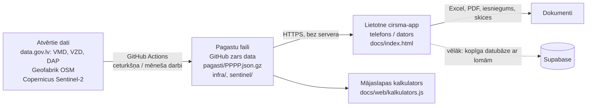

# FF Forest meža sistēma: tehniskā un lietotāja dokumentācija

Versija: 2026-09-01 (lietotne v0.24). Kods un dati: https://github.com/kgudonis-dotcom/geo-ingest
Darbu dēlis: https://github.com/kgudonis-dotcom/geo-ingest/issues · Kopsavilkums: STATUSS.md

Dokuments rakstīts cilvēkam, kas nav programmētājs, bet grib saprast, kas notiek, kur kas atrodas un ko drīkst mainīt. Tehniskās detaļas ir atsevišķos blokos, tās var izlaist.

---

## 1. Kas šī ir par sistēmu, vienā rindkopā

Ievadi zemes vienības kadastra numuru, sistēma no Valsts meža dienesta (VMD) un citiem atvērtajiem datiem uzbūvē objektu: nogabalus ar taksāciju un kontūrām, kaimiņus, dabas aizsardzības ierobežojumus, un uzreiz izrēķina cirsmas pēc likuma (MK 935), koksnes vērtību, nekustamā īpašuma vērtību, IRR un bruto peļņu, uzzīmē skices un sagatavo iesniegumu VMD. Cilvēks labo to, ko redz mežā, un sistēma pārrēķina. Tālāk objekts iet cauri CRM plūsmai (vērtēšana → piedāvājums → vienošanās → nopirkts) ar uzdevumiem pa lomām, un nonāk fondā.

## 2. Sistēmas daļas un kā tās saistās



Trīs slāņi:

| Slānis | Kas tas ir | Kur atrodas | Kad mainās |
|---|---|---|---|
| **Datu ķēde** | Python skripti, ko GitHub Actions palaiž pēc grafika vai pēc pieprasījuma; tie novelk atvērtos datus un sagriež pa pagastiem | repo `main` zars: `build_pagasti.py`, `build_infra.py`, `sentinel.py`, `export_geo.py`, `ingest.py`, `discover.py`, `.github/workflows/*.yml` | reizi ceturksnī (VMD publicē pa ceturkšņiem), OSM reizi mēnesī, Sentinel pēc pieprasījuma |
| **Dati** | Gatavi faili, ko lietotne lasa | repo `data` zars: `pagasti/`, `infra/`, `sentinel/`, `aplieci/` | katru reizi, kad datu ķēde nostrādā |
| **Lietotne** | Viens HTML fails ar visu loģiku, strādā pārlūkā, arī bezsaistē | repo `app/index.html` (avots) un `docs/index.html` (publicētais), tiešsaistē https://kgudonis-dotcom.github.io/geo-ingest/ | ar katru versiju |

Principi, kas nosaka uzbūvi: bez servera (nav ko uzturēt un nav ko maksāt), viss atvērtajos datos, viss, ko cilvēks labo, paliek ierīcē un nekad netiek pārrakstīts ar automātiku, krāsas nozīmē vienu un to pašu (dzeltens = ar roku, zils = automātiski, sarkans = aizliegums vai nokavēts).

---

## 3. Datu ķēde (geo-ingest)

### 3.1. Pagasta fails: galvenā datu vienība
Kadastra apzīmējuma pirmie 4 cipari ir pagasta (administratīvās teritorijas) kods. Katrs pagasts ir viens saspiests fails `pagasti/PPPP.json.gz` (0,5 līdz 5 MB), kurā ir visas tā pagasta meža zemes vienības:

```json
{"pagasts":"7060","updated":"2026-09-01","ladSig":{"n":842,"maxdate":1735689600000},"zv":{
  "70600050074":{
    "stands":[{"kv":"4","nog":"22","anog":null,"plat":0.71,"zkat":"10","mt":"5",
               "s10":"9","a10":44,"h10":19,"d10":20,"g10":19, "s11":"4",...,
               "p_cirp":"11","p_cirg":2017,"saimn_d_ie":6,"bon":"II",
               "geom":[[lon,lat],[lon,lat],...]}],
    "adj":[[0,2,112],[0,10,61]],
    "iadt":[{"kind":"iadt","name":"Vestiena","zone":"AAA","ha":28.1}],
    "kaimini":[{"kad":"70600050099","len_m":393,"owner":null}],
    "lielie":[{"owner":"AS Latvijas valsts meži","hops":1,"kad":"...","dist_m":0}],
    "lad":{"ha":0.42,"blocks":["7060123-4"]},
    "expl":{"liz":0.15,"krum":0.03,"mezs":0.71,"purvs":0,"udens":0,"ekas":0,"celi":0.02,"cita":0},
    "ni":{"nr":"70600050074001","name":"Ezermuiža"}
  }}}
```

Lauku nozīme (VMD Meža valsts reģistra struktūra):
- `kv`, `nog`, `anog`: kvartāls, nogabals, apakšnogabals. `plat`: platība ha. `zkat`: zemes kategorija (10 = mežaudze). `mt`: meža tipa kods (5 = Vēris; pilna tabula lietotnē `MT_CODES`).
- `s10..s14`: 1. stāva elementu sugas (kodi: 1 Priede, 3 Egle, 4 Bērzs, 6 Melnalksnis, 8 Apse, 9 Baltalksnis, 10 Ozols, 11 Osis), `a`/`h`/`d`/`g`/`n`: vecums, augstums, caurmērs, šķērslaukums, koku skaits katram elementam.
- `p_cirp`/`p_cirg`: pēdējās cirtes veids un gads; `p_darbv`/`p_darbg`: pēdējā darbība; `saimn_d_ie`: saimnieciskās darbības ierobežojuma kods (APROB klasifikators, "Aizliegts KailC" analogs); `jakopj`, `jaatjauno`: VMD karodziņi.
- `bon`: valdošās sugas bonitāte, VMD BON klasifikators (kods 0-6 → Ia, I, II, III, IV, V, Va; 0 = Ia, labākā). Avots: `gis.vmd.gov.lv/Public/GetClasificators` (xlsx), lapas "BON_klasifikators" / "Struktūra_KOPĀ", lauks "BON". Nosaka `cirtmetsKC` slieksni lietotnē (#46); ja tukšs, cirtmets netiek noteikts (nevis pieņemts sliktākais gadījums).
- `geom`: nogabala kontūra WGS84 (lon, lat), vienkāršota līdz 1 m.
- `adj`: kaimiņu pāri nogabalu indeksos ar kopējās robežas garumu metros (rēķināts būvē).
- `iadt`: DAP (Ozols) slāņu pārklājums: ĪADT, zonējums, mikroliegums, biotops, sugas atradne, aizsargājams koks, dabas piemineklis, ar ha.
- `kaimini`: tieši robežojošās meža zemes vienības ar robežas garumu un lielā īpašnieka nosaukumu (ja LVM dati pieejami); `lielie`: tuvākie lielie īpašnieki līdz 3 soļiem pa kaimiņu ķēdi.
- `lad`: LAD lauku bloku pārklājums ar ZV, `{ha, blocks}` — `ha` ir bloku ∩ ZV platība, `blocks` bloku numuru saraksts. Avots: `karte.lad.gov.lv` ArcGIS REST (`lauku_bloki/MapServer/0/query`), lasīts pa pagasta bbox. `ladSig` pagasta faila saknē (`{n, maxdate}`, bloku skaits + jaunākais `VALID_FROM`) ir lēts paraksts: ja nākamajā būvē paraksts sakrīt, LAD ģeometrijas vaicājums tiek izlaists (dati nav mainījušies).
- `expl`: VZD zemes vienības lietošanas mērķu eksplikācija ha: `liz` (lauksaimniecībā izmantojamā zeme), `krum` (krūmāji), `mezs`, `purvs`, `udens`, `ekas` (zeme zem ēkām), `celi`, `cita`, `meliorets`. Avots: VZD datu kopa "kadastra-informacijas-sistemas-atvertie-dati", resurss `parcel.zip` (XML), lauki `AgricultTotal`, `Bushes`, `Forest`, `Swamp`, `UnderWaterTotal`, `UnderBuildings`, `UnderRoads`, `OtherLand`, `Drained` (m² → ha, summēts pa visiem ZV lietošanas mērķiem).
- `ni`: nekustamā īpašuma numurs un nosaukums, `{nr, name}`. Avots: tā pati VZD datu kopa, resurss `property.zip` (XML), lauki `ProCadastreNr` un `PropertyName`; `name` var būt `null`. Lietotnē: objekta nosaukums (`niLabel`), NĪ-māsu ZV atrašana vienā objektā (`siblingZV`).

### 3.2. Skripti (katrs ar docstring faila sākumā)

| Fails | Ko dara | Ieeja | Izeja |
|---|---|---|---|
| `build_pagasti.py` | Novelk VMD MVR SHP pa virsmežniecībām (data.gov.lv CKAN API), DAP 6 datu kopas, LVM īpašniekus (no Release "mirror"), LAD lauku blokus (`karte.lad.gov.lv`), VZD eksplikāciju un NĪ saiti (`parcel.zip`/`property.zip`); katram nogabalam vienkāršo ģeometriju, katrai ZV rēķina kaimiņus, ĪADT pārklājumu, lielos īpašniekus; raksta `pagasti/*.json.gz` | `--index N` (viens VMD fails, matricas darbam), `--filter vidzem`, `--no-owners`, `--no-iadt`, `--no-lad`, `--no-expl`, `--no-ni`, `--first` | `pagasti/` mape |
| `merge_pagasti.py` | Apvieno vairāku paralēlo darbu artefaktus ar esošo datu zaru (esošais + jaunais, jaunais uzvar) | `artifacts/**` | `pagasti/` |
| `build_infra.py` | OSM (Geofabrik) ceļi un ūdensteces pa pagastiem (pagasta aptvērums + 2 km) | `pagasti/` | `infra/PPPP.json.gz` |
| `sentinel.py` | Copernicus Sentinel-2: vasaras NDVI pērn pret šogad katram nogabalam; kritums > 0,25 = vainaga zudums | `--kad` vai `--pagasts`, noslēpumi `CDSE_ID`, `CDSE_SECRET` | `sentinel/PPPP.json.gz` |
| `export_geo.py` | Vienas ZV ģeometrija (no DB vai tieši no VMD zip) | `EXPORT_REQ` fails: `<kadastrs> <filtrs>` | `geo/<kadastrs>.json` |
| `ingest.py`, `schema.sql` | Rezerves ceļš: tie paši dati Supabase PostGIS datubāzē ar RPC `geo_by_kadastrs` | `DATABASE_URL` | tabulas `stands`, `protected`, `expl`, `classifiers` |
| `discover.py` | Izlūkošana: kuras datu kopas ir, kādi lauki, kuri serveri no GitHub sasniedzami | `DISCOVER` fails | logs |
| `build_aplieci.py` | VMD apliecinājumu slāņa meklēšana (VMD to vairs nepublicē; darbs izslēgts no grafika) | | |
| `mirror/lvm_spogulis.py` | Skripts datorā Latvijā: novelk LVM failus un ieliek Release "mirror" | GitHub talons | Release faili |

**Datu avoti**, ko `build_pagasti.py` novelk un iestrādā pagasta failā:

| Avots | Ko dod | Atjaunošanas biežums |
|---|---|---|
| VMD MVR (data.gov.lv CKAN API, SHP pa virsmežniecībām) | `stands`, `adj` | reizi ceturksnī (`pagasti.yml` grafiks) |
| DAP Ozols (6 datu kopas) | `iadt` | reizi ceturksnī, kopā ar VMD būvi |
| LVM īpašnieki (Release "mirror", jo `lvmgeo.lvm.lv` no GitHub nesasniedzams) | `owners`, `lielie`, `kaimini.owner` | pēc pieprasījuma (`mirror/lvm_spogulis.py`, ārpus GitHub) |
| **LAD lauku bloki** (`karte.lad.gov.lv` ArcGIS REST) | `lad {ha, blocks}` | reizi ceturksnī, kopā ar VMD būvi; `ladSig` paraksts izlaiž vaicājumu, ja bloki pagastā nav mainījušies |
| **VZD `parcel.zip`** (data.gov.lv, "kadastra-informacijas-sistemas-atvertie-dati") | `expl` (lietošanas mērķu eksplikācija) | reizi ceturksnī, kopā ar VMD būvi |
| VZD `property.zip` (tā pati datu kopa) | `ni {nr, name}` | reizi ceturksnī, kopā ar VMD būvi |
| OSM (Geofabrik) | `infra/PPPP.json.gz` (ceļi, grāvji) | reizi mēnesī (7. datumā) |
| Copernicus Sentinel-2 | `sentinel/PPPP.json.gz` (NDVI kritums) | pēc pieprasījuma, tikai saviem objektiem |

### 3.3. Darbplūsmas (GitHub Actions, mape `.github/workflows`)
Palaišana notiek ar "trigera failiem": izmainot failu repo, sākas darbs. Tas izvēlēts tāpēc, ka piekļuves talonam nav tiesību palaist darbus tieši.

| Darbplūsma | Trigeris | Ko dara | Grafiks |
|---|---|---|---|
| `pagasti.yml` | `PAGASTI_ARGS` (saturs = argumenti, piem. `--no-owners`, `--no-lad`, `--no-expl`, `--no-ni`) | 10 paralēli darbi pa VMD failiem → `merge` apvieno un publicē `data` zarā | 6. janv., apr., jūl., okt. |
| `remerge.yml` | `REMERGE` (saturs = run id) | Atkārto apvienošanu no esošiem artefaktiem bez pārbūves | pēc pieprasījuma |
| `infra.yml` | `INFRA_RUN` | OSM ceļi un grāvji | 7. datumā katru mēnesi |
| `sentinel.yml` | `SENTINEL_RUN` (saturs = argumenti) | Sentinel-2 | pēc pieprasījuma |
| `export.yml` | `EXPORT_REQ` | vienas ZV eksports | pēc pieprasījuma |
| `discover.yml` | `DISCOVER` | izlūkošana | pēc pieprasījuma |
| `ingest.yml` | `RUN_ARGS` | Supabase ielāde (rezerve) | 5. janv., apr., jūl., okt. |
| `aplieci.yml` | `APLIECI_RUN` | VMD apliecinājumi (izslēgts grafiks) | |

Katrs darbs ieraksta savu izdruku mapē `logs/` (galvenajā zarā), tāpēc vienmēr var redzēt, kas notika.

**Datu publicēšana `data` zarā (#43).** Visas sešas darbplūsmas, kas raksta uz `data` zaru (`pagasti.yml`, `remerge.yml`, `infra.yml`, `aplieci.yml`, `sentinel.yml`, `iadt.yml`), publicēšanai izmanto vienu kopīgu skriptu `scripts/publish_data.sh <apakšmape> [<apakšmape> ...]`, nevis katra savu kopiju. Tas:
- aizvieto TIKAI norādīto(-ās) apakšmapi(-es) (piem. `pagasti`, `infra`, `iadt`) ar parastu commit uz `data` zaru — pārējais zara saturs (citu avotu apakšmapes) paliek neskarts;
- ja `push` tiek noraidīts, jo kāds cits darbs starplaikā jau publicējis (divas darbplūsmas mēģina rakstīt vienlaicīgi) — fetch + rebase + push mēģina vēlreiz līdz 3 reizēm;
- tukšas apakšmapes drošinātājs: ja norādītajā apakšmapē nav neviena faila, skripts beidzas ar kļūdu un nekas nepublicējas (nekad nepublicē tukšu rezultātu);
- katrai darbplūsmas job, kas publicē, ir `concurrency: {group: data-publish, cancel-in-progress: false}` — publicēšanas soļi savā starpā rindojas, nevis sacenšas, tāpēc rebase-retry parasti pat nav vajadzīgs, bet paliek kā otrā aizsardzības līnija.
- Vēstures augšanu (visbiežāk no `pagasti`, ~300 MB) ierobežo periodisks squash (`--squash "ziņa"` karogs) — reizi ceturksnī (`pagasti.yml` grafika palaidienā) zars tiek sākts no jauna ar visu pašreizējo saturu, nevis pieaugot bezgalīgi; parastā publicēšana squash neizmanto.

**Jauna apakšmape (piem. jauns datu avots):** pievieno attiecīgās darbplūsmas publicēšanas solī `bash scripts/publish_data.sh <jaunā-apakšmape>` argumentu sarakstam un pievieno `concurrency: {group: data-publish, cancel-in-progress: false}` tās job līmenī, ja tā vēl nav. Neko citu pielāgot nevajag — skripts pats izlasa esošo `data` zara saturu un pieraksta tikai savu daļu.

**Zināms ierobežojums:** `pagasti/` vēsturiski nejauši nokļuvis arī `main` zarā (nevis tikai `data`); katra darbplūsma, kas lasa vai raksta `pagasti/`, pēc `actions/checkout@v4` to vispirms izdzēš (`rm -rf pagasti`), lai `main` zarā iesaldētā vecā versija nesajauktos ar `data` zara svaigo saturu. Pati `main` zara piesārņojuma novēršana (izņemt `pagasti/` no `main` izsekošanas) nav šī labojuma daļa.

### 3.4. Zināmie ierobežojumi datu pusē
- No GitHub nav sasniedzami `lvmgeo.lvm.lv` (LVM), `gis.vmd.gov.lv` (VMD ģeoportāls), `melioracija.lv`. Sasniedzami: `data.gov.lv`, `geolatvija.lv`, `karte.lad.gov.lv`, Geofabrik, Copernicus.
- LVM datu kopas data.gov.lv saites ir mirušas (LVM pārkārtoja savu platformu, kiberuzbrukums 2026). Risinājums: faili Release "mirror".
- VMD izsniegtos ciršanas apliecinājumus publiski vairs nerāda; aizstāts ar kaimiņu svaigo izcirtumu noteikšanu (pēdējās cirtes gads) un manuālu ievadi.
- Copernicus bezmaksas kvota: Sentinel tikai saviem objektiem, ne visai Latvijai.

---

## 4. Lietotne cirsma-app

### 4.1. Kā tā ir uzbūvēta (nav ietvaru, viens fails)
`index.html` satur CSS, HTML karkasu un visu JavaScript loģiku (~3000 rindas). Ārējās bibliotēkas no CDN: SheetJS (Excel), pdf.js (PDF lasīšana), Turf.js (ģeometrija: buferi, apvienojumi, šķēlumi), pako (gzip), Leaflet (karte). `sw.js` ir service worker: kešo lietotni un bibliotēkas bezsaistei; pagastu faili kešojas ar Cache API. `manifest.json` ļauj pievienot sākuma ekrānam kā lietotni.

**Stāvoklis (`S`)**: viens objekts atmiņā un `localStorage`: `S.props` (objekti), `S.prices` (sortimentu cenas), `S.settings` (iestatījumi, īpašnieks, komanda), `S.people`, `S.lang`. `save()` ieraksta un pārzīmē. Nekas neiet uz serveri.

**Objekts (`p`)**: `kadastrs`, `name`, `status`, `mer` (nogabalu mērījumi), `cirsmas`, `val` (novērtējums), `tasks`, `comments`, `log`, `kaimini`, `dapList`, `kaimCuts`, `aplieci`, `priceSnap`, darījuma lauki.
**Nogabals (`m`)**: `kvartals`, `nogabals`, `platKop`, `platMezs`, `veids`, `mezaTips`, `suga`, `formula` (sastāvs), `vecums`, `H`, `D`, `G`, `krajaImp` (krāja no dokumenta) vai rēķināta, `certamais`, `cirsmaKods` (KC/KKC), `buferPct`, `geom`, `man` (kuri lauki laboti un kāpēc), `src`.
**Cirsma (`c`)**: `tips` (Kc, KKC, Izlase, Sanitārā, Rekonstruktīvā), `kvartals`, `nogabali`, `platiba`, `species` (m³ un sortimentu % pa sugām), izmaksas, `marza`, `status`, `faktM3`, `dast` (dastojums), `izvedCels`, `krautuve`.

### 4.2. Koda karte (sadaļas `index.html` ar `/* ---------- NOSAUKUMS ---------- */`)
| Sadaļa | Galvenās funkcijas | Ko dara |
|---|---|---|
| DEFAULTS | `SPECIES`, `DEFAULT_PRICES`, `SORT_D`, `FORM_FACTOR`, `RULES` | noklusējumi: sugas, cenas, sortimentu sadalījums pēc caurmēra, formas koeficienti, noteikumi |
| MK 935 | `MK935.gLimits`, `nLimits`, `dCirte`, `kkcCertamais` | likuma tabulas un kopšanas cērtamais (Gkrit + 2) |
| STATE | `S`, `P()`, `C()`, `M()`, `save()`, `render()` | stāvoklis un pārzīmēšana |
| APRĒĶINI | `krajaMer`, `speciesShares`, `calcCirsma`, `calcProp`, `rebuildCirsma`, `sortSharesForD` | krāja (G × H × f), cirsmas m³ un nauda |
| PĀRBAUDES | `runChecks`, `cirsmaLegal`, `legalBlocks`, `moistureOf`, `cirtmetsKC`, `nogPlausibleIssue`, `krajaMerChecked`, `bonOf` | MK935 karodziņi, limiti, buferi (`turf.intersect` ar kaimiņa buferi), kaimiņu izcirtumi, nogabalu datu ticamība, bonitāte |
| VALODA | `RU`, `translateNode`, `t()` | krievu tulkojums pēc renderēšanas |
| ĪPAŠUMA NOVĒRTĒJUMS | `VAL_ROWS`, `valAutoHa`, `valCalc`, `xirr` | PAF: zemes rindas, nodeva MK1250, plūsmas, IRR |
| PAGASTU FAILI | `loadPagasts`, `cachedFetch`, `gunzipJson`, `pagastsToExtra`, `createFromPagasts`, `attachGeometry` | datu ielāde un objekta būve; ģeometrijas pievienošana importētiem |
| VMD OBJEKTS | `buildFromGeo`, `MT_CODES`, `SP_CODES`, `wgsToLks` | kodu atšifrēšana, LKS-92 projekcija |
| KAIMIŅU IZCIRTUMI | `neighbourCuts` | svaigie izcirtumi kaimiņu ZV |
| ROBEŽU PLĀNS | `planSvg` | SVG plāns ar cirsmām, joslām, izcirtumiem |
| DASTOJUMS | `treeVol` (Liepa), `tallyCalc`, `parseMezverte`, `parsePielikums10`, `applyTally` | koku uzmērīšanas imports |
| EXCEL / IESNIEGUMS | `exportXlsx`, `iesniegumsHtml`, `CIRTES_VEIDI` | eksports un VMD veidlapa |
| CRM | `setStatus`, `addTask`, `logIt`, `deadlines`, `tracker`, `crmCard`, `vDeg` | plūsma, uzdevumi, termiņi, rezultāts šodien |
| FONDS | `fundStats`, `vFund`, `mountFundMap` | visu objektu kopskats |
| PĀRSKATS | `vDash`, `nogCategory`, `urgentActions`, `svgBars`, `svgPie`, `mountMap` | KPI, karte, grafiki |
| DOKUMENTI | `showDoc`, `vDocs`, `openSkice`, `openReport`, `openIesniegums` | dokumentu skatītājs lietotnē |
| SKICES | `skiceHtml`, `unionRings` | skice ar koordinātu tabulu |
| IMPORTS | `impFile`, `parsePdfLines`, `guessMap`, `impCreate` | Kadastra atskaite un VMD PDF |
| SKATI | `vObj`, `vCirs`, `vMer`, `vVal`, `vCen`, `vSet` | ekrāni |

### 4.3. Galvenās formulas (lai varētu pārbaudīt ar roku)
- Krāja nogabalā, ja nav dokumentā: `Σ (Gᵢ × Hᵢ × fᵢ) × platība`, kur f ir formas koeficients pa sugām (`FORM_FACTOR`, piem. Priede 0,45, Egle 0,47).
- Kailcirtes cērtamais: krāja − eko koki (8/ha × 1,2 m³) − zudumi %. Kopšanas cērtamais bez VMD certamais: `krāja × (G − (Gkrit + 2)) / G`.
- Sortimenti: katrai sugai % pēc nogabala vidējā caurmēra (`SORT_D` tabula) vai, ja ir dastojums, pēc katra koka caurmēra.
- Ieņēmumi = Σ m³ × % × €/m³; max cena = ieņēmumi × (1 − marža) − m³ × (sagatavošana + pievešana + transports).
- Koka tilpums dastojumā (Liepa): `V = ψ · H^α · D^(β·lg H + γ)`, koeficienti pa sugām `DEFAULT_LIEPA` (rediģējami Cenās).
- Buferjosla: nogabals ∩ buferis(kaimiņa nogabals, platums m); atliktie m³ = joslas ha × nogabala m³/ha.
- IRR: XIRR pa dienām no plūsmām [iegāde (0. d., −), koksne = max cena (90. d.), meža zeme (365. d.), LIZ (365. d.)]; bruto = ieplūdes − iegāde.
- Nodeva: `min(likme × max(pirkums, kadastrālā), 50 000) + 14,23 + 7,11`, likme 2 % / 1,5 % / 0,5 %.

**Nogabalu ticamības pārbaude (#45).** VMD dbf avota dati reizēm satur decimālkļūdas (piem. krāja ×100 par lielu). `nogPlausibleIssue(m)` katram nogabalam pārbauda krāju/ha > 900 m³/ha vai G > 80 m²/ha; ja pārkāpts, nogabals sarkans ("Krāja ārpus iespējamā, avota kļūda") un izslēgts no kopsummām (`krajaMerChecked` — Pārskats, Fonds, cirsmas), kamēr nav labots. `krajaMer` (rādīšanai pa nogabalu) paliek nemainīts. Ja gan krāja, gan G pārkāpj UN abi kļūst ticami pēc dalīšanas ar 100, pieejama poga "Labot ×0,01" ar diviem klikšķiem apstiprinājumam (`arm()`); pēc labošanas lauki dzelteni (labots ar roku) un ieraksts vēsturē. Nekad nelabo automātiski.

**Cirtmets pēc bonitātes (#46).** `cirtmetsKC(suga, vecums, bonitāte)` nosaka KC pieļaujamību pēc MK935 (Priedei I-III bon. 101 g, IV un zemāka 121 g; pārējām sugām attiecīga tabula) — ja bonitāte nav zināma, cirtmets NETIEK noteikts (agrāk klusi pieņēma sliktāko gadījumu, kas nepamatoti bloķēja KC). `bonOf(m)` dod bonitāti trīs pakāpēs: reāla (VMD `bon` lauks) > H/vecuma aproksimācija (dzeltens karogs "bonitāte aptuvena") > nezināma (sarkans karogs, cirtmets nenosakāms). H/vecuma aproksimācijas tabula pagaidām ir vispārīga Orlova tipa formula, nevis MK Nr. 384 (2016) 3. pielikuma "Mežaudžu bonitāšu skala" — tā jāaizstāj, kolīdz tā ir uzticami nolasāma.

### 4.4. Lietošana soli pa solim
1. Atver https://kgudonis-dotcom.github.io/geo-ingest/ (telefonā: "Pievienot sākuma ekrānam"). Pirmajā reizē izvēlies valodu.
2. Iestatījumi: īpašnieka rekvizīti (iesniegumam), komanda un lomas, naudas izmaksas %, mērķa bruto %, buferjoslas platums. Cenas: sortimentu cenas, zemes cenas, izmaksas.
3. Objekti → kadastra numurs → Izveidot. Vai Importēt (Kadastra atskaite, VMD PDF); ģeometrija pieliekas pati.
4. Pārskats: KPI, karte, uzdevumi, komentāri, vēsture, rezultāts šodien. Statusa maiņa objekta kartītē (Cirsmas) rada uzdevumus.
5. Cirsmas: pārbaudi likumdošanas bloku (sarkans = nedrīkst), robežu plānu, katrai cirsmai sortimentus, izmaksas, izvešanas ceļu, krautuvi; "Importēt dastojumu", ja mežā uzmērīts; "Pabeigt cirsmu" ar faktu, kad nocirsts.
6. Mērījumi: labo to, ko redz dabā (lauks kļūst dzeltens); viss pārrēķinās.
7. Novērtējums: zemes rindas, darījums, nodeva, IRR, bruto peļņa, prasītās cenas, "Kāpēc šie skaitļi".
8. Dokumenti: atskaite, Excel, iesniegums VMD ar skicēm, katras cirsmas skice; "Drukāt / PDF".
9. Fonds: visi objekti, "Kas deg".

### 4.5. Ko drīkst mainīt bez programmētāja
Cenas, izmaksas, maržu, zemes cenas, buferjoslas platumu, sortimentu sadalījuma tabulu, Liepas koeficientus, komandu un lomas: viss Iestatījumos un Cenās, saglabājas ierīcē; "Lejupielādēt JSON" ir rezerves kopija. Likuma tabulas (MK935, nodevas) ir kodā (`MK935`, `valCalc`), tās maina tikai ar jaunu versiju, jo mainās likums.

---

## 5. Mājaslapas kalkulators (`web/`)
`kalkulators.js` ir neatkarīga, samazināta lietotnes dzinēja kopija (VMD kodi, MK935 cirtmets un caurmērs, Gkrit+2, sortimenti, cenas). `MezaKalkulators.mount(el, {contactUrl, showValue, dataBase, prices, costM3, marza})`. Rezultāts: KPI, nogabalu karte, sugu grafiks, dabas vērtības, tabula; summa rādās kā diapazons (−15 % / +10 %) vai slēpjas aiz kontaktformas (POST uz `contactUrl` ar laukiem vards, talrunis, epasts, kadastrs, aprēķins). Notikums `mk:result` uz konteinera. Nekas netiek sūtīts, kamēr apmeklētājs neaizpilda formu.

---

## 6. Kā strādā ar kodu (izstrāde)
- Repo struktūra: `app/` (lietotnes avots), `docs/` (publicētā kopija GitHub Pages; katrs push uz `main` pārpublicē), `web/` (kalkulators), `mirror/` (spogulis), skripti saknē, `.github/workflows/`, `logs/`, `STATUSS.md`, `DOKUMENTACIJA.md`.
- Versija: `const APP_VERSION` lietotnē, redzama galvenē; katra versija ir viens commit ar aprakstu.
- Testēšana: lietotni var pārbaudīt bez pārlūka ar Node + jsdom (kā darīts izstrādē): ielādē `index.html`, izsauc `impFile`, `impCreate`, `createFromPagasts`, `calcProp`, `valCalc`, salīdzina ar zināmām vērtībām (Vigodas Excel, PAF_70420080041 IRR 67,0 %, Ezermuiža 1,43 ha skice, Saklauru dastojums 513 koki D 29,79).
- Datu ķēdes tests: `python build_pagasti.py --dry --first` izdrukā lauku nosaukumus, neko nerakstot; `export_geo.py` ir ātrākais veids dabūt viena kadastra datus.
- Kļūdu meklēšana: `logs/` mapē katra darba izdruka; Actions cilnē soļu statuss.
- Noslēpumi (repo Settings → Secrets → Actions): `DATABASE_URL` (Supabase), `CDSE_ID`, `CDSE_SECRET` (Copernicus). Kodā nekad nav paroļu.

## 7. Vārdnīca
KC kailcirte · KKC krājas kopšanas cirte · MVR Meža valsts reģistrs · ZV zemes vienība · ĪADT īpaši aizsargājama dabas teritorija · DAP Dabas aizsardzības pārvalde (Ozols) · LIZ lauksaimniecībā izmantojamā zeme · PAF īpašuma novērtējuma forma (Excel priekštecis) · G šķērslaukums m²/ha · Gkrit kritiskais šķērslaukums (MK935 1. piel.) · cirtmets vecums, no kura atļauta KC · PVZ pavadzīme · StanForD harvesteru datu standarts · LKS-92 / LKS-2020 Latvijas koordinātu sistēmas · NDVI veģetācijas indekss no satelīta.
